# Execution Guide - Token System Module Generation

This document provides comprehensive information about the token-based system models, their relationships, and step-by-step instructions for generating new modules in the existing Node.js/Mongoose project.

---

## 📋 Table of Contents

- [Models Documentation](#models-documentation)
- [Entity Relationship Diagram](#entity-relationship-diagram)
- [Module Generation Instructions](#module-generation-instructions)

---

## Models Documentation

### 🧩 Feature

System main feature (AI writing, image generation, etc.)

**Fields**

- `_id` — ObjectId
- `parent` — ObjectId (Ref: Feature) (optional, for sub-feature relationship)
- `name` — String (required)
- `description` — String (optional)
- `path` — String (optional, frontend route path)
- `prefix` — String (optional, API namespace prefix for endpoints)
- `type` — Enum: `writing | generation | other` (optional, categorizes feature)
- `is_active` — Boolean (default: true, feature availability)
- `is_deleted` — Boolean (default: false, soft delete flag)
- `created_at`, `updated_at` — Auto-generated by Mongoose timestamps

---

### 🔗 FeatureEndpoint

Specific API endpoint for a feature and its token requirement.

**Fields**

- `_id` — ObjectId
- `feature` — ObjectId (Ref: Feature) (required, parent feature reference)
- `name` — String (required, API name or label)
- `description` — String (optional)
- `endpoint` — String (required, e.g., `/api/v1/blog`)
- `method` — Enum: `GET | POST | PUT | PATCH | DELETE` (required, HTTP method)
- **Note**: The combination of `feature`, `endpoint`, and `method` must be unique for non-deleted records (compound unique index)
- `token` — Number (required, minimum token needed to access this endpoint)
- `is_active` — Boolean (default: true, endpoint availability)
- `is_deleted` — Boolean (default: false, soft delete flag)
- `created_at`, `updated_at` — Auto-generated by Mongoose timestamps

---

### 🎁 Package

Token packages available for purchase by users.

**Fields**

- `_id` — ObjectId
- `name` — String (required, package title)
- `description` — String (optional)
- `content` — String (optional, HTML allowed, detailed package info)
- `token` — Number (required, total tokens included in package)
- `features` — ObjectId[] (Ref: Feature) (required, features included in package)
- `duration` — Number (optional, validity in days)
- `price` — Object (required, current price in both currencies)
  - `USD` — Number (required, price in USD)
  - `BDT` — Number (required, price in BDT)
- `price_previous` — Object (optional, previous price for reference)
  - `USD` — Number (optional, previous price in USD)
  - `BDT` — Number (optional, previous price in BDT)
- `is_active` — Boolean (default: true, package availability)
- `is_deleted` — Boolean (default: false, soft delete flag)
- `created_at`, `updated_at` — Auto-generated by Mongoose timestamps

---

### 📝 PackageHistory

History of previous package data when updated.

**Fields**

- `_id` — ObjectId
- `package` — ObjectId (Ref: Package) (required, reference to the original package)
- `name` — String (required)
- `description` — String (optional)
- `content` — String (optional)
- `token` — Number (required)
- `features` — ObjectId[] (Ref: Feature) (required)
- `duration` — Number (required, package validity in days at that time)
- `price` — Object (required, package price at that time)
  - `USD` — Number (required, price in USD at that time)
  - `BDT` — Number (required, price in BDT at that time)
- `previous_price` — Object (optional, previous price at that time)
  - `USD` — Number (optional, previous price in USD)
  - `BDT` — Number (optional, previous price in BDT)
- `is_active` — Boolean (optional)
- `is_deleted` — Boolean (optional)
- `created_at`, `updated_at` — Auto-generated by Mongoose timestamps

---

### 💳 PaymentMethod

Configuration for payment gateways.

**Fields**

- `_id` — ObjectId
- `name` — String (required, unique, e.g., "Stripe", "SSL Commerz")
- `value` — String (required, unique, lowercase, e.g., "stripe", "sslcommerz")
- `currency` — String (required, 3-letter ISO code)
- `secret` — String (required, gateway secret key)
- `public_key` — String (optional, if required by gateway, e.g., Stripe webhook secret)
- `description` — String (optional)
- `webhook_url` — String (optional, webhook URL for this payment method)
- `is_test` — Boolean (optional, default: false, whether this is test/sandbox mode)
- `currencies` — String[] (optional, array of supported currencies, e.g., ["USD", "EUR"])
- `config` — Object (optional, additional gateway-specific configuration, stored as JSON)
- `is_active` — Boolean (default: true, method availability)
- `is_deleted` — Boolean (default: false, soft delete flag)
- `created_at`, `updated_at` — Auto-generated by Mongoose timestamps

---

### 👛 UserWallet

User token balance container.

**Fields**

- `_id` — ObjectId
- `user` — ObjectId (Ref: User, required, unique, one wallet per user)
- `package` — ObjectId (Ref: Package, required, purchased package)
- `token` — Number (required, remaining available tokens)
- `expires_at` — Date (optional, calculated from package duration)
- `created_at`, `updated_at` — Auto-generated by Mongoose timestamps

---

### 🔄 TokenTransaction

History of token increases and decreases.

**Fields**

- `_id` — ObjectId
- `user` — ObjectId (Ref: User, required)
- `user_wallet` — ObjectId (Ref: UserWallet, required)
- `type` — Enum: `increase | decrease` (required)
- `amount` — Number (required, token amount)
- `increase_source` — Enum: `payment | bonus` (conditional, only if type = increase)
- `decrease_source` — ObjectId (Ref: FeatureEndpoint) (conditional, only if type = decrease, API endpoint used)
- `payment_transaction` — ObjectId (Ref: PaymentTransaction) (conditional, only if type = increase AND increase_source = payment)
- `is_deleted` — Boolean (default: false, soft delete)
- `created_at`, `updated_at` — Auto-generated by Mongoose timestamps

---

### 💰 PaymentTransaction

Package purchase transaction history.

**Fields**

- `_id` — ObjectId
- `user` — ObjectId (Ref: User, required)
- `user_wallet` — ObjectId (Ref: UserWallet, required)
- `status` — Enum: `pending | success | failed | refunded` (required, current payment state)
- `payment_method` — ObjectId (Ref: PaymentMethod, required)
- `gateway_transaction_id` — String (required, transaction ID from payment gateway, indexed)
- `gateway_session_id` — String (optional, gateway session ID, e.g., Stripe session ID or SSL Commerz session ID, indexed)
- `gateway_status` — String (optional, gateway-specific status, e.g., "paid", "VALID", "FAILED")
- `package` — ObjectId (Ref: Package, required)
- `amount` — Number (required, payment amount)
- `currency` — Enum: `USD | BDT` (required, payment currency)
- `gateway_fee` — Number (optional, fee charged by payment gateway)
- `failure_reason` — String (optional, reason if payment failed)
- `refund_id` — String (optional, gateway refund transaction ID)
- `refunded_at` — Date (optional, date when refund was processed)
- `paid_at` — Date (optional, date when payment was completed)
- `failed_at` — Date (optional, date when payment failed)
- `customer_email` — String (optional, customer email from gateway)
- `customer_name` — String (optional, customer name from gateway)
- `gateway_response` — Object (optional, raw response data from gateway for debugging, not included in default queries)
- `is_deleted` — Boolean (default: false, soft delete)
- `created_at`, `updated_at` — Auto-generated by Mongoose timestamps

---

### 📈 TokenProfit

Settings for profit percentage on token sales.

**Fields**

- `_id` — ObjectId
- `name` — String (required, unique, e.g., "Standard Profit")
- `percentage` — Number (required, profit % applied)
- `is_active` — Boolean (default: true, active status)
- `is_deleted` — Boolean (default: false)
- `created_at`, `updated_at` — Auto-generated by Mongoose timestamps

---

### 🕒 TokenProfitHistory

History of updates to TokenProfit settings.

**Fields**

- `_id` — ObjectId
- `token_profit` — ObjectId (Ref: TokenProfit, required, original profit setting reference)
- `name` — String (required, profit setting name at that time)
- `percentage` — Number (required, % at that time)
- `is_active` — Boolean (optional)
- `is_deleted` — Boolean (optional)
- `created_at`, `updated_at` — Auto-generated by Mongoose timestamps

---

### 📧 Contact

Contact form submissions from users.

**Fields**

- `_id` — ObjectId
- `name` — String (required, 2-100 characters, contact person name)
- `email` — String (required, valid email format, indexed)
- `subject` — String (required, 3-200 characters, message subject)
- `message` — String (required, 10-5000 characters, message content)
- `created_at`, `updated_at` — Auto-generated by Mongoose timestamps

**Note**: Contact model is standalone and does not have relationships with other models. It is used for storing contact form submissions.

---

## Entity Relationship Diagram

```mermaid
erDiagram
    User {
        ObjectId _id PK "Required, Primary Key"
    }

    Feature {
        ObjectId _id PK "Required, Primary Key"
        ObjectId parent FK "Optional, Reference: Feature._id"
        string name "Required"
        string description "Optional"
        string path "Optional, Frontend route path"
        string prefix "Optional, API namespace prefix"
        string type "Optional, Enum: writing | generation | other"
        boolean is_active "Optional, Default: true, Feature availability"
        boolean is_deleted "Optional, Default: false, Soft delete"
        timestamp created_at "Optional, Auto-generated"
        timestamp updated_at "Optional, Auto-generated"
    }

    FeatureEndpoint {
        ObjectId _id PK "Required, Primary Key"
        ObjectId feature FK "Required, Reference: Feature._id"
        string name "Required, API name/label"
        string description "Optional"
        string endpoint "Required, e.g. /api/v1/blog"
        string method "Required, Enum: GET | POST | PUT | PATCH | DELETE"
        number token "Required, Minimum token needed"
        boolean is_active "Optional, Default: true, Endpoint availability"
        boolean is_deleted "Optional, Default: false, Soft delete"
        timestamp created_at "Optional, Auto-generated"
        timestamp updated_at "Optional, Auto-generated"
    }

    Package {
        ObjectId _id PK "Required, Primary Key"
        string name "Required, Package title"
        string description "Optional"
        string content "Optional, HTML allowed, Detailed info"
        number token "Required, Total tokens included"
        array features "Required, Reference: Feature._id[]"
        number duration "Optional, Validity in days"
        object price "Required, Current price object with USD and BDT"
        object price_previous "Optional, Previous price object with USD and BDT"
        boolean is_active "Optional, Default: true, Package availability"
        boolean is_deleted "Optional, Default: false, Soft delete"
        timestamp created_at "Optional, Auto-generated"
        timestamp updated_at "Optional, Auto-generated"
    }

    PackageHistory {
        ObjectId _id PK "Required, Primary Key"
        ObjectId package FK "Required, Reference: Package._id"
        string name "Required"
        string description "Optional"
        string content "Optional"
        number token "Required"
        array features "Required, Reference: Feature._id[]"
        number duration "Required, Validity in days at that time"
        object price "Required, Price object with USD and BDT at that time"
        object previous_price "Optional, Previous price object with USD and BDT at that time"
        boolean is_active "Optional"
        boolean is_deleted "Optional"
        timestamp created_at "Optional, Auto-generated"
        timestamp updated_at "Optional, Auto-generated"
    }

    PaymentMethod {
        ObjectId _id PK "Required, Primary Key"
        string name "Required, Unique, e.g. Stripe, SSL Commerz"
        string value "Required, Unique, lowercase, e.g. stripe, sslcommerz"
        string currency "Required, 3-letter ISO code"
        string secret "Required, Gateway secret key"
        string public_key "Optional, If required by gateway, e.g. Stripe webhook secret"
        string description "Optional"
        string webhook_url "Optional, Webhook URL for this payment method"
        array currencies "Optional, Array of supported currencies"
        object config "Optional, Additional gateway-specific configuration"
        boolean is_test "Optional, Default: false, Test/sandbox mode"
        boolean is_active "Optional, Default: true, Method availability"
        boolean is_deleted "Optional, Default: false, Soft delete"
        timestamp created_at "Optional, Auto-generated"
        timestamp updated_at "Optional, Auto-generated"
    }

    UserWallet {
        ObjectId _id PK "Required, Primary Key"
        ObjectId user FK "Required, Unique, Reference: User._id, One wallet per user"
        ObjectId package FK "Required, Reference: Package._id, Purchased package"
        number token "Required, Remaining available tokens"
        date expires_at "Optional, Calculated from package duration"
        timestamp created_at "Optional, Auto-generated"
        timestamp updated_at "Optional, Auto-generated"
    }

    TokenTransaction {
        ObjectId _id PK "Required, Primary Key"
        ObjectId user FK "Required, Reference: User._id"
        ObjectId user_wallet FK "Required, Reference: UserWallet._id"
        string type "Required, Enum: increase | decrease"
        number amount "Required, Token amount"
        string increase_source "Conditional, Enum: payment | bonus, Only if type = increase"
        ObjectId decrease_source FK "Conditional, Reference: FeatureEndpoint._id, Only if type = decrease"
        ObjectId payment_transaction FK "Conditional, Reference: PaymentTransaction._id, Only if type = increase AND increase_source = payment"
        boolean is_deleted "Optional, Default: false, Soft delete"
        timestamp created_at "Optional, Auto-generated"
        timestamp updated_at "Optional, Auto-generated"
    }

    PaymentTransaction {
        ObjectId _id PK "Required, Primary Key"
        ObjectId user FK "Required, Reference: User._id"
        ObjectId user_wallet FK "Required, Reference: UserWallet._id"
        string status "Required, Enum: pending | success | failed | refunded"
        ObjectId payment_method FK "Required, Reference: PaymentMethod._id"
        string gateway_transaction_id "Required, Transaction ID from payment gateway, Indexed"
        string gateway_session_id "Optional, Gateway session ID, Indexed"
        string gateway_status "Optional, Gateway-specific status, e.g. paid, VALID, FAILED"
        ObjectId package FK "Required, Reference: Package._id"
        number amount "Required, Payment amount"
        string currency "Required, Enum: USD | BDT, Payment currency"
        number gateway_fee "Optional, Fee charged by payment gateway"
        string failure_reason "Optional, Reason if payment failed"
        string refund_id "Optional, Gateway refund transaction ID"
        date refunded_at "Optional, Date when refund was processed"
        date paid_at "Optional, Date when payment was completed"
        date failed_at "Optional, Date when payment failed"
        string customer_email "Optional, Customer email from gateway"
        string customer_name "Optional, Customer name from gateway"
        object gateway_response "Optional, Raw response data from gateway for debugging"
        boolean is_deleted "Optional, Default: false, Soft delete"
        timestamp created_at "Optional, Auto-generated"
        timestamp updated_at "Optional, Auto-generated"
    }

    TokenProfit {
        ObjectId _id PK "Required, Primary Key"
        string name "Required, Unique, e.g. Standard Profit"
        number percentage "Required, Profit percentage applied"
        boolean is_active "Optional, Default: true, Active status"
        boolean is_deleted "Optional, Default: false, Soft delete"
        timestamp created_at "Optional, Auto-generated"
        timestamp updated_at "Optional, Auto-generated"
    }

    TokenProfitHistory {
        ObjectId _id PK "Required, Primary Key"
        ObjectId token_profit FK "Required, Reference: TokenProfit._id"
        string name "Required, Profit setting name at that time"
        number percentage "Required, Percentage at that time"
        boolean is_active "Optional"
        boolean is_deleted "Optional"
        timestamp created_at "Optional, Auto-generated"
        timestamp updated_at "Optional, Auto-generated"
    }

    Contact {
        ObjectId _id PK "Required, Primary Key"
        string name "Required, 2-100 characters, Contact person name"
        string email "Required, Valid email format, Indexed"
        string subject "Required, 3-200 characters, Message subject"
        string message "Required, 10-5000 characters, Message content"
        timestamp created_at "Optional, Auto-generated"
        timestamp updated_at "Optional, Auto-generated"
    }

    %% Relationships with detailed arrows
    User ||--o{ UserWallet : "has (One-to-Many)"
    User ||--o{ TokenTransaction : "performs (One-to-Many)"
    User ||--o{ PaymentTransaction : "makes (One-to-Many)"
    UserWallet ||--o{ TokenTransaction : "records (One-to-Many)"
    UserWallet ||--o{ PaymentTransaction : "associated_with (One-to-Many)"
    UserWallet }|--|| Package : "purchased_package (Many-to-One)"
    Feature ||--o{ FeatureEndpoint : "has (One-to-Many)"
    Feature }o--o{ Feature : "parent/child (Self-Referential)"
    Package ||--o{ PackageHistory : "maintains_history (One-to-Many)"
    Package }o--o{ Feature : "includes_features (Many-to-Many)"
    PaymentMethod ||--o{ PaymentTransaction : "used_by (One-to-Many)"
    FeatureEndpoint ||--o{ TokenTransaction : "consumed_by (One-to-Many, via decrease_source)"
    PaymentTransaction ||--o{ TokenTransaction : "triggers (One-to-Many, via payment_transaction)"
```



---

## Module Generation Instructions

```text
I have an existing Node.js / Mongoose project with a modular architecture.
The project already contains all necessary credentials and configurations.
I want you to help me create new modules based on a data model document.

Here are the instructions:

1. **Data Model Reference**:
   - Use the attached data model document (Feature, FeatureEndpoint, Package, PackageHistory, PaymentMethod, UserWallet, TokenTransaction, PaymentTransaction, TokenProfit, TokenProfitHistory).
   - Include all fields, types, enums, optional/required flags, and any additional logic notes.

2. **Follow Existing Project Structure**:
   - Analyze the existing module structure to understand folder/file patterns for:
     - Models / Schema
     - Types / Interfaces
     - Routes
     - Validation (request body / params)
     - Controllers
     - Services
   - Use the same conventions for naming, folder placement, and code style.

3. **Module Creation**:
   - For each collection (Feature, FeatureEndpoint, etc.), generate:
     - Mongoose schema with proper types, enums, default values, and timestamps.
     - TypeScript types/interfaces if project uses TypeScript.
     - Validation logic (e.g., using Zod or existing project validator).
     - Routes following REST conventions.
     - Controller skeleton with CRUD operations.
     - Service layer functions to handle business logic (e.g., token deduction, package assignment, payment status updates).
   - Ensure that each module is self-contained but can interact with related modules (e.g., FeatureEndpoint references Feature, TokenTransaction references UserWallet and PaymentTransaction).

4. **Additional Instructions**:
   - Follow the modular pattern exactly as in the existing project.
   - Use Mongoose timestamps for created_at and updated_at; do not mark them as required.
   - Include any conditional fields (e.g., increase_source, decrease_source) with proper validation.
   - Include comments to indicate important logic points (e.g., token deduction, package purchase, payment validation).

5. **Outcome**:
   - Produce ready-to-use modules that can be directly added to the existing project without breaking existing conventions.
   - Ensure scalability, maintainability, and proper reference handling between modules.

**Notes for AI**:
- The project uses modular folder structure with each module containing: schema/model, types, routes, controller, service.
- Maintain the same naming conventions, patterns, and code style as in the existing project.
- Use this data model as the source of truth for fields, types, and relations.
- In this project, a separate **User Module** cannot be created because **user and auth are handled from a different server**. However, the user information can still be accessed from `req` since `auth.middleware` attaches `req.user`. And even though the **User schema/model is not defined** in this project, both this project's database and the **user-auth service database are the same**, so the required user data will still be available.
- Mongoose session will be used, where multiple operations will be executed.

**Action**:
Analyze the project folder structure, then generate the new modules for each collection in the data model, respecting all the above instructions.
```

---

## 📌 Important Notes

- All timestamps (`created_at`, `updated_at`) are automatically managed by Mongoose
- Soft delete pattern is used throughout (using `is_deleted` flag)
- Conditional fields require proper validation based on the `type` field value
- Token transactions must maintain referential integrity with UserWallet and PaymentTransaction
- Package features utilize a many-to-many relationship with the Feature model

---

## 🔗 Key Relationships

1. **User → UserWallet**: One-to-Many (A user can have multiple wallets over time)
2. **Package → Features**: Many-to-Many (Packages include multiple features)
3. **Feature → FeatureEndpoint**: One-to-Many (Each feature has multiple endpoints)
4. **UserWallet → TokenTransaction**: One-to-Many (Wallet records all token movements)
5. **PaymentTransaction → TokenTransaction**: One-to-Many (Payment triggers token increase)

---

## 💡 Usage

Use this documentation as a reference when:

- Creating new modules in the project
- Understanding the token system flow
- Implementing payment and wallet features
- Setting up validation schemas
- Establishing relationships between models

---
