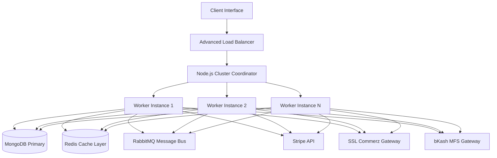
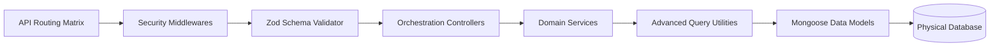
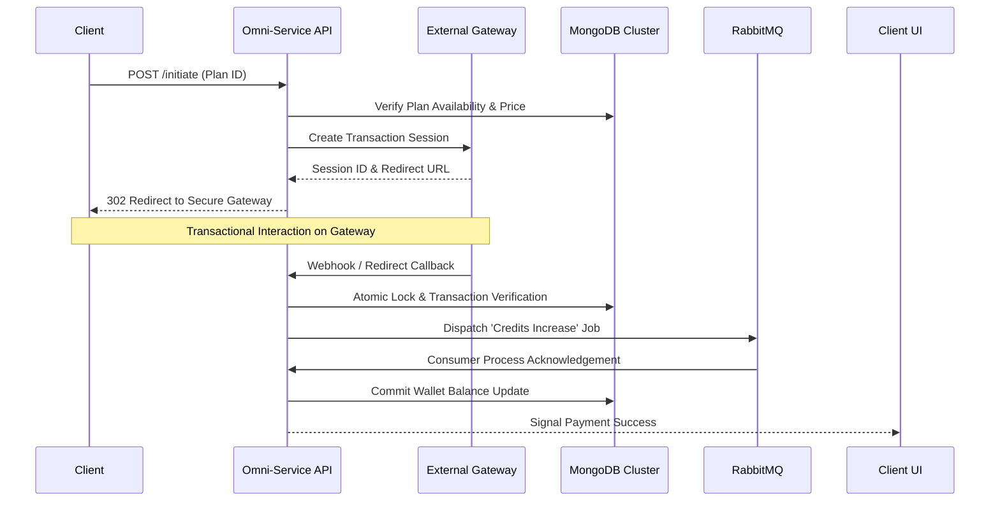
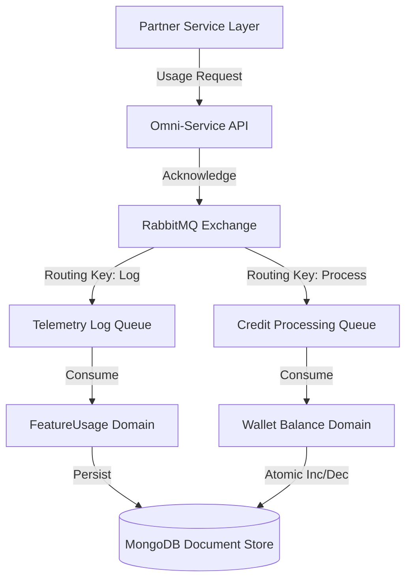

# ZaaZ Server

This high-performance, enterprise-grade multi-purpose backend architecture orchestrates user wallets, multi-currency credit transactions, tiered subscription packages, AI model orchestration, and robust asynchronous processing. Engineered for scalability and high-concurrency, it serves as the backbone for the main ecosystem.

---

## Table of Contents

- [Core Modules and Features](#core-modules-and-features)
- [Tech Stack](#tech-stack)
- [Architecture](#architecture)
- [Project Directory Map](#project-directory-map)
- [Database Schema](#database-schema)
- [Detailed API Endpoints](#detailed-api-endpoints)
- [Endpoint Operation Patterns](#endpoint-operation-patterns)
- [Getting Started](#getting-started)
- [Workflow Diagrams](#workflow-diagrams)
- [Development and Deployment](#development-and-deployment)

---

## Core Modules and Features

### Authentication and Security

- Hybrid Authentication: Unified support for traditional Email/Password and modern Google OAuth 2.0 SSO.
- JWT Ecosystem: Advanced token lifecycle management including rotate-on-refresh, email verification, and secure password reset tokens.
- RBAC Architecture: Granular Role-Based Access Control system (super-admin, admin, editor, author, contributor, subscriber, user).
- Enterprise Security: Built-in protection using Helmet.js, expressive rate limiting, CORS whitelisting, and atomic database updates to eliminate race conditions.

### Credit and Wallet Management

- Atomic Wallet Engine: Real-time credit balance tracking using high-performance concurrency controls.
- Diverse Credit Sourcing: Multi-channel credit acquisition via direct payments, promotional coupons, or administrative bonus provisions.
- Dynamic Consumption Logic: Internal service-to-service validation APIs specifically designed for feature-rich environments and word-limit enforcement.
- Expiration Engine: Automated duration-based expiration logic for both credits and tiered packages.

### Subscription and Product Packaging

- Multi-Currency Tiering: Flexible package management supporting USD and BDT with distinct token/subscription types.
- SNAPSHOT Versioning: PackageHistory architecture maintains immutable records of package states, ensuring financial integrity for active user subscriptions.
- Onboarding Logic: Automated initial offer enforcement to streamline user acquisition credits.

### Payment Gateway Infrastructure

- Omni-Channel Payment Support:
  - Stripe: High-availability international USD processing.
  - SSL Commerz: Leading localized BDT transaction engine.
  - bKash: Seamless mobile financial service integration.
- Webhook Reliability: Signature-verified webhook handlers with secondary asynchronous status reconciliation.
- Atomic Settlement: Guaranteed single-settlement logic using MongoDB atomic operators across all gateways.

### AI Capabilities and Operational Billing

- Model Registry: Centralized management for Large Language Models (LLM) and specialized AI models with dynamic metadata.
- Intelligence Billing: Global and model-specific billing rules for real-time cost/profit calculation during credit processing.

### Asynchronous Communication and Observability

- Distributed Messaging: RabbitMQ-driven architecture featuring Dead Letter Queues (DLQ) and Publisher Confirms for usage telemetry.
- Real-time Signaling: Socket.io with Redis backplane for horizontally scalable real-time event broadcasting.
- Notification Engine: Multi-path delivery (Web, Push, Email) with priority tiers and delivery tracking.

---

## Tech Stack

| Category             | Technology                                        |
| :------------------- | :------------------------------------------------ |
| Runtime Environment  | Node.js (v18+)                                    |
| Core Framework       | Express.js (v5.x - Next Generation)               |
| Programming Language | TypeScript (v5.x)                                 |
| Persistent Storage   | MongoDB with Mongoose (v8.x)                      |
| Message Broker       | RabbitMQ (amqplib) with DLQ support               |
| Distributed Caching  | Redis (ioredis) for Lookups and Socket.io         |
| Optimized Querying   | AppAggregationQuery (Deep lookup and aggregation) |
| Runtime Validation   | Zod (End-to-end schema safety)                    |
| Information Security | bcrypt, jsonwebtoken, helmet, express-rate-limit  |

---

## Architecture

### System Architecture Diagram

<div align="center">



</div>

The system leverages a coordinated Node.js cluster architecture to maximize multi-core hardware efficiency. A perimeter load balancer directs traffic to a Cluster Coordinator, which manages a pool of worker instances. These workers interact with a distributed caching layer (Redis) for session/cache data, a resilient MongoDB primary for persistence, and a RabbitMQ bus for background telemetry. External integrations are handled through a unified gateway interface for payment and AI services.

### Module Architecture Diagram

<div align="center">



</div>

Our modular architecture enforces a unidirectional dependency flow. Incoming requests traverse a security middleware stack before Zod validators verify payload integrity. Business logic is strictly encapsulated within Domain Services, which utilize optimized Query Utilities (AppAggregationQuery) for high-performance data retrieval before committing atomic changes via Mongoose Data Models.

---

## Project Directory Map

```text
src/
├── app/
│   ├── builder/        # Advanced Aggregation Query Engine and Custom Error Classes
│   ├── config/         # Multi-environment Registry and Feature Flags
│   ├── errors/         # Specialized Handlers for Validation, Duplication, and Cast Errors
│   ├── interface/      # Global Type Definitions and Interface Contracts
│   ├── middlewares/    # Auth, RBAC, Rate-Limiting, and Data Sanitization
│   ├── modules/        # Feature-specific Domain Modules (29 production-grade modules)
│   ├── rabbitmq/       # Message Broker Connections and Consumer Registry
│   ├── redis/          # Distributed Cache configuration and Pub/Sub logic
│   ├── socket/         # Real-time Event Orchestration and Redis backplane
│   ├── utils/          # Core Utilities (catchAsync, sendResponse, Credit Process Wrappers)
│   └── routes/         # Centralized API Versioning and Route Mounting
├── app.ts              # Express Pipeline Configuration
└── index.ts            # Entry Point and Managed Cluster Execution
```

---

## Database Schema

### Detailed Relational Architecture

```mermaid
erDiagram
    %% ============================================
    %% CORE USER MANAGEMENT
    %% ============================================

    User {
        ObjectId _id PK
        string name "Required, 2-50 chars"
        string email "Required, Unique, Indexed"
        string password "Hashed, select: false"
        string role "super-admin|admin|editor|author|contributor|subscriber|user"
        string auth_source "email|google"
        string google_id "Optional, Indexed"
        string status "in-progress|blocked"
        boolean is_verified
        boolean is_deleted
        timestamp created_at
        timestamp updated_at
    }

    %% ============================================
    %% WALLET & CREDITS SYSTEM
    %% ============================================

    UserWallet {
        ObjectId _id PK
        ObjectId user FK "Unique, Indexed"
        string email "Indexed"
        ObjectId package FK
        ObjectId plan FK
        number credits "Available balance"
        date expires_at
        boolean initial_credits_given
        boolean initial_package_given
        string type "free|paid"
        boolean is_deleted
    }

    CreditsTransaction {
        ObjectId _id PK
        ObjectId user FK
        string email
        ObjectId user_wallet FK
        string type "increase|decrease"
        number credits
        string increase_source "payment|bonus"
        ObjectId decrease_source FK "FeatureEndpoint"
        ObjectId payment_transaction FK
        ObjectId plan FK
        string usage_key
        boolean is_active
        boolean is_deleted
    }

    CreditsUsage {
        ObjectId _id PK
        ObjectId user FK
        string email
        ObjectId user_wallet FK
        string usage_key
        ObjectId credits_transaction FK
        number credit_price
        string ai_model
        number input_tokens
        number output_tokens
        number input_credits
        number output_credits
        number profit_credits "Internal"
        number cost_credits "Internal"
        number cost_price "Internal"
        boolean is_active
        boolean is_deleted
    }

    %% ============================================
    %% FEATURES & ENDPOINTS
    %% ============================================

    Feature {
        ObjectId _id PK
        ObjectId parent FK "Self-reference"
        string name "Required"
        string description
        string path "Frontend path"
        string prefix "API prefix"
        string type "writing|generation|other"
        boolean is_active
        boolean is_deleted
    }

    FeatureEndpoint {
        ObjectId _id PK
        ObjectId feature FK
        string name "API Label"
        string description
        string endpoint "URL path"
        string method "GET|POST|PUT|DELETE|PATCH"
        number credits "Cost per use"
        boolean is_active
        boolean is_deleted
    }

    FeatureUsageLog {
        ObjectId _id PK
        ObjectId feature_endpoint FK
        ObjectId user FK
        string email
        string usage_key
        string endpoint
        string method
        object params
        object query
        object payload
        object response
        number code
        string status "success|failed"
        string type
        boolean is_deleted
    }

    %% ============================================
    %% PACKAGES & PLANS
    %% ============================================

    Package {
        ObjectId _id PK
        string value "Unique, Indexed"
        string name
        string description
        string content "HTML content"
        string type "credits|subscription"
        string badge
        string[] points
        number sequence
        boolean is_initial "Unique"
        boolean is_active
        boolean is_deleted
    }

    Plan {
        ObjectId _id PK
        string name "Indexed"
        string description
        number duration "Days"
        number sequence
        boolean is_active
        boolean is_deleted
    }

    PackagePlan {
        ObjectId _id PK
        ObjectId plan FK
        ObjectId package FK
        object price "USD and BDT"
        object previous_price
        number credits
        boolean is_initial
        boolean is_active
        boolean is_deleted
    }

    PackageFeature {
        ObjectId _id PK
        ObjectId package FK
        ObjectId feature FK
        number sequence
        boolean is_active
        boolean is_deleted
    }

    PackageHistory {
        ObjectId _id PK
        ObjectId package FK
        string name
        object[] features "Snapshots"
        object[] plans "Snapshots"
        boolean is_active
        boolean is_deleted
    }

    %% ============================================
    %% PAYMENT SYSTEM
    %% ============================================

    PaymentMethod {
        ObjectId _id PK
        string name "e.g. Stripe"
        string value "e.g. stripe"
        string currency "ISO code"
        string secret "Encrypted"
        string public_key
        string webhook_url
        string[] currencies
        object config
        boolean is_test
        boolean is_active
        boolean is_deleted
    }

    PaymentTransaction {
        ObjectId _id PK
        ObjectId user FK
        string email
        ObjectId user_wallet FK
        string status "pending|success|failed|refunded"
        ObjectId payment_method FK
        string gateway_transaction_id
        string gateway_session_id
        string gateway_status
        ObjectId package FK
        ObjectId plan FK
        ObjectId price FK "PackagePlan"
        ObjectId coupon FK
        number discount_amount
        number amount
        string currency "USD|BDT"
        number gateway_fee
        string failure_reason
        string refund_id
        date refunded_at
        date paid_at
        date failed_at
        string customer_email
        string customer_name
        string return_url
        string cancel_url
        boolean is_test
        boolean is_active
        boolean is_deleted
    }

    Coupon {
        ObjectId _id PK
        string code "Unique, Uppercase"
        string discount_type "percentage|fixed"
        number discount_value
        object fixed_amount "USD/BDT"
        object min_purchase_amount
        object max_discount_amount
        date valid_from
        date valid_until
        number usage_limit
        number usage_count
        ObjectId[] applicable_packages FK
        boolean is_active
        boolean is_deleted
    }

    %% ============================================
    %% BILLING CONFIGURATION
    %% ============================================

    BillingSetting {
        ObjectId _id PK
        number credit_price
        string currency "USD"
        string status "active|inactive"
        date applied_at
        boolean is_active
        boolean is_initial
        boolean is_deleted
    }

    CreditsProfit {
        ObjectId _id PK
        string name "Unique"
        number percentage "0-100"
        boolean is_active
        boolean is_deleted
    }

    AiModel {
        ObjectId _id PK
        string name "Unique"
        string value "Code, Unique"
        string provider "e.g. OpenAI"
        number input_token_price
        number output_token_price
        string currency "Default: USD"
        boolean is_active
        boolean is_initial
        boolean is_deleted
    }

    AiModelHistory {
        ObjectId _id PK
        ObjectId ai_model FK
        string name
        string value
        number input_token_price
        number output_token_price
        boolean is_active
        boolean is_deleted
    }

    BillingSettingHistory {
        ObjectId _id PK
        ObjectId billing_setting FK
        number credit_price
        string currency "USD"
        string status "active|inactive"
        date applied_at
        boolean is_active
        boolean is_deleted
    }

    CreditsProfitHistory {
        ObjectId _id PK
        ObjectId credits_profit FK
        string name
        number percentage "0-100"
        boolean is_active
        boolean is_deleted
    }

    %% ============================================
    %% NOTIFICATIONS
    %% ============================================

    Notification {
        ObjectId _id PK
        string title
        string message
        string type "request|approval"
        string priority "low|medium|high|urgent"
        string[] channels "web|push|email"
        ObjectId sender FK
        date expires_at
        string status "active|inactive|archived"
        boolean is_deleted
    }

    NotificationRecipient {
        ObjectId _id PK
        ObjectId notification FK
        ObjectId recipient FK
        object metadata "URL/Image/Actions"
        boolean is_read
        date read_at
        boolean is_deleted
    }

    %% ============================================
    %% STORAGE
    %% ============================================

    Storage {
        ObjectId _id PK
        string name
        string url
        string path
        string mimetype
        number size
        string provider "local|gcs"
        boolean is_deleted
    }

    %% ============================================
    %% PRIMARY RELATIONSHIPS
    %% ============================================

    %% User to Wallet (1:1)
    User ||--|| UserWallet : "owns"

    %% Wallet to Package/Plan
    UserWallet }o--|| Package : "subscribed_to"
    UserWallet }o--|| Plan : "active_plan"

    %% Credits Flow
    User ||--o{ CreditsTransaction : "initiates"
    UserWallet ||--o{ CreditsTransaction : "tracks"
    CreditsTransaction ||--|| CreditsUsage : "details"

    %% Feature System
    Feature ||--o{ Feature : "parent_child"
    Feature ||--o{ FeatureEndpoint : "exposes"
    FeatureEndpoint ||--o{ FeatureUsageLog : "logs"

    %% Package Architecture
    Package ||--o{ PackagePlan : "priced_as"
    Plan ||--o{ PackagePlan : "defines_duration"
    Package ||--o{ PackageFeature : "includes"
    Feature ||--o{ PackageFeature : "available_in"
    Package ||--o{ PackageHistory : "versioned"

    %% Payment Flow
    User ||--o{ PaymentTransaction : "makes"
    PaymentMethod ||--o{ PaymentTransaction : "processes"
    PaymentTransaction }o--|| PackagePlan : "purchases"
    PaymentTransaction }o--o| Coupon : "applies"
    PaymentTransaction ||--o| CreditsTransaction : "generates"

    %% Usage Tracking
    User ||--o{ CreditsUsage : "consumes"
    User ||--o{ FeatureUsageLog : "activity"
    FeatureEndpoint ||--o| CreditsTransaction : "costs"

    %% Notifications
    User ||--o{ Notification : "sends"
    User ||--o{ NotificationRecipient : "receives"
    Notification ||--o{ NotificationRecipient : "delivered_to"

    %% Configuration History
    AiModel ||--o{ AiModelHistory : "tracks_changes"
    BillingSetting ||--o{ BillingSettingHistory : "tracks_changes"
    CreditsProfit ||--o{ CreditsProfitHistory : "tracks_changes"
```

<div align="center">



</div>

The database utilizes a highly relational document-oriented schema optimized for financial consistency and historical auditability across 27 core persistent collections. The architecture employs junction tables (`PackagePlan` and `PackageFeature`) to establish normalized many-to-many relationships between Packages, Plans, and Features, eliminating data redundancy while maintaining query performance through optimized aggregation pipelines. Essential metadata and security fields are strictly enforced at the Mongoose layer. Critical transactional data is protected via SNAPSHOT History collections (AiModelHistory, PackageHistory, BillingSettingHistory, etc.), which capture immutable configurations at the point of sale, ensuring that historical records remain accurate regardless of future configuration changes.

---

## Detailed API Endpoints

The service layer exposes the following API clusters via the `/api` namespace:

- Identity Management: `/api/auth` (Sign-in, Sign-up, Google SSO, Password Recovery)
- Value Exchange: `/api/credits-transactions`, `/api/credits-process`, `/api/credits-usages`
- Financial Operations: `/api/payment-transactions`, `/api/payment-methods`, `/api/package-transactions`
- Catalog and Inventory: `/api/packages`, `/api/plans`, `/api/package-plans`, `/api/package-features`, `/api/coupons`
- Service Entitlements: `/api/features`, `/api/feature-endpoints`, `/api/feature-popups`
- Intelligence Governance: `/api/ai-models`, `/api/billing-settings`
- Infrastructure Services: `/api/dashboard`, `/api/notifications`, `/api/storage`, `/api/contact`

---

## Endpoint Operation Patterns

Standardization is enforced across all domain modules using consistent HTTP patterns for predictable integration:

- Multi-Record Retrieval: `GET /api/{module}` (Includes Server-side Search, Complex Filtering, and Smart Pagination)
- Single Record Access: `GET /api/{module}/:id` (Full hydration of target document)
- Record Initialization: `POST /api/{module}` (Zod-enforced payload validation)
- Delta Modification: `PATCH /api/{module}/:id` (Strict partial updates)
- Resource Decommission: `DELETE /api/{module}/:id` (Soft delete strategy by default)
- Bulk Operation: `DELETE /api/{module}/bulk` (Transactional array processing)
- Lifecycle Restoration: `POST /api/{module}/:id/restore` (Soft delete reversal)
- Physical Eradication: `DELETE /api/{module}/:id/permanent` (Final byte-level removal)

---

## Workflow Diagrams

### Payment Settlement Workflow

<div align="center">



</div>

The Payment Settlement Workflow is engineered for maximum financial resilience. By utilizing an atomic locking mechanism at the database level, the system prevents duplicate processing of the same transaction. The credit assignment is decoupled through RabbitMQ, ensuring that even if the main gateway callback completes, the intensive wallet calculations are processed with guaranteed delivery, mitigating losses during network instability.

### Asynchronous Telemetry and Credit Consumption

<div align="center">



</div>

This asynchronous workflow decouples high-frequency AI feature requests from database write operations. When a partner service consumes an AI capability, the API emits a specialized message to the RabbitMQ bus. Independent consumers then handle usage telemetry and wallet balance adjustments in parallel. This prevents the primary API thread from being blocked by database I/O, allowing the system to scale to thousands of concurrent usage events.

---

## Development and Deployment

### Development Environment Setup

1. Dependency Management:

   ```bash
   pnpm install
   ```

2. Environment Provisioning:
   Populate the `.env` file from the supplied configuration template.

3. Locally Managed Execution:
   ```bash
   pnpm start:dev
   ```

### Deployment and Distribution

1. Transpilation and Build:

   ```bash
   pnpm build
   ```

2. Production Clustering:
   Execute the coordinated Node.js cluster for high-availability performance:

   ```bash
   npm run start
   ```

3. Containerized Orchestration:
   Deploy via the integrated Docker pipeline:
   ```bash
   docker-compose up -d --build
   ```

---

## Production Readiness Checklist

- Cluster Engine: Coordinated process clustering enabled by default for single-node scaling.
- MQ Resilience: Dead Letter Queues (DLQ) configured for all critical consumers to prevent message loss.
- Atomic Integrity: All financial state changes utilize MongoDB atomic increments and concurrency locks.
- Security Posture: Full Zod runtime validation and JWT lifecycle rotation enforced.
- Observability: Intensive telemetry logging through asynchronous RabbitMQ workers.

---

## License

Proprietary and Confidential. Unauthorized duplication, modification, or distribution is strictly prohibited.
