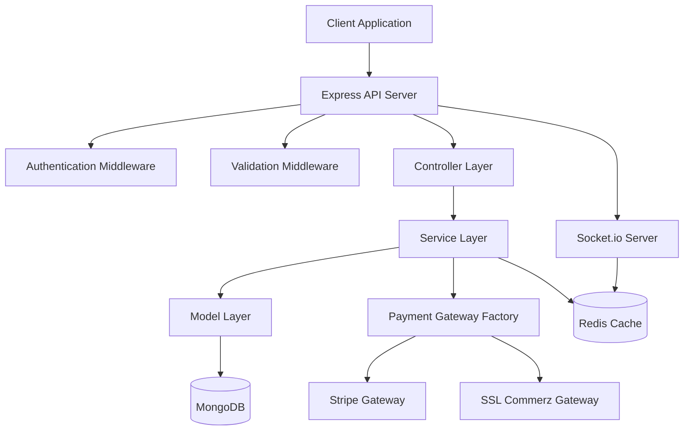
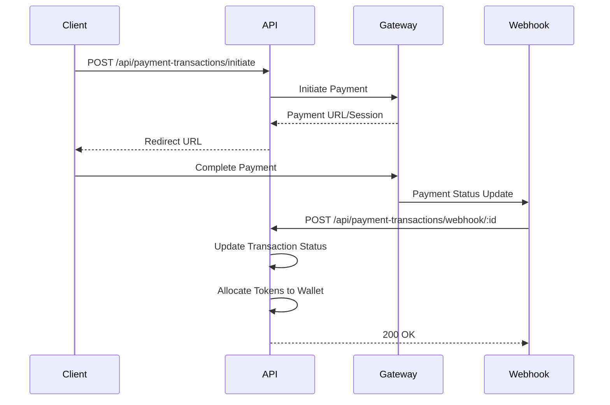

# Payment System Server

A robust, scalable token-based payment system server built with Node.js, Express.js, and TypeScript. This system manages user wallets, token transactions, package purchases, and integrates with multiple payment gateways (Stripe and SSL Commerz) for seamless payment processing.

## 📋 Table of Contents

- [Features](#-features)
- [Tech Stack](#-tech-stack)
- [Architecture](#-architecture)
- [Project Structure](#-project-structure)
- [Database Schema](#-database-schema)
- [API Endpoints](#-api-endpoints)
- [Getting Started](#-getting-started)
- [Environment Variables](#-environment-variables)
- [Payment Gateway Integration](#-payment-gateway-integration)
- [Development](#-development)
- [Deployment](#-deployment)
- [Contributing](#-contributing)

---

## ✨ Features

### Core Functionality

- **User Management**: Complete user authentication and authorization system with role-based access control
- **Authentication**: JWT-based authentication with signup, signin, password reset, and email verification
- **Token-Based System**: Manage user tokens for accessing premium features
- **Package Management**: Create and manage token packages with multi-currency support (USD/BDT)
- **Payment Processing**: Integrated payment gateways (Stripe & SSL Commerz)
- **Wallet Management**: User wallet system with token balance tracking
- **Transaction History**: Complete audit trail for all token and payment transactions
- **Feature Access Control**: Define features and endpoints with token requirements
- **Profit Management**: Configurable profit percentage settings with history tracking
- **Notification System**: Comprehensive notification system with multi-channel support (web, push, email)
- **Notification Recipients**: User-specific notification delivery and read status tracking

### Technical Features

- **Modular Architecture**: Clean, maintainable codebase with separation of concerns
- **Type Safety**: Full TypeScript implementation with strict type checking
- **Validation**: Zod schema validation for request/response data
- **Error Handling**: Centralized error handling with custom error classes
- **Soft Delete**: Soft delete pattern for data retention
- **Query Builder**: Advanced query builder with search, filter, sort, pagination
- **Webhook Support**: Secure webhook handling for payment status updates
- **Real-time Communication**: Socket.io integration for real-time updates
- **Caching**: Redis integration for performance optimization
- **Session Management**: MongoDB session store for scalable sessions

---

## 🛠 Tech Stack

### Core Technologies

- **Runtime**: Node.js
- **Framework**: Express.js 5.x
- **Language**: TypeScript 5.x
- **Database**: MongoDB (Mongoose 8.x)
- **Cache**: Redis 5.x
- **Real-time**: Socket.io 4.x

### Key Libraries

- **Validation**: Zod 3.x
- **Authentication**: JWT (jsonwebtoken)
- **Payment Gateways**: Stripe SDK, SSL Commerz API
- **Email**: Nodemailer
- **File Upload**: Multer
- **Session**: express-session with MongoDB store

### Development Tools

- **Linting**: ESLint
- **Formatting**: Prettier
- **Git Hooks**: Husky
- **Process Manager**: ts-node-dev

---

## 🏗 Architecture

### System Architecture



### Module Architecture

The project follows a **layered architecture pattern** with clear separation of concerns:

```
Request Flow:
Route → Controller → Service → Model → Database
         ↓
    Validation
         ↓
    Error Handling
```

### Module Structure

Each module follows a consistent structure:

```
module-name/
├── module-name.route.ts      # HTTP route definitions
├── module-name.controller.ts # Request handlers
├── module-name.service.ts    # Business logic
├── module-name.model.ts      # Mongoose schema
├── module-name.type.ts       # TypeScript types
└── module-name.validation.ts # Zod validation schemas
```

---

## 📁 Project Structure

```
src/
├── app/
│   ├── builder/              # Core utility classes
│   │   ├── AppError.ts       # Custom error class
│   │   └── AppQuery.ts       # Advanced query builder
│   ├── config/               # Configuration management
│   ├── errors/               # Error handlers
│   │   ├── handleCastError.ts
│   │   ├── handleDuplicateError.ts
│   │   ├── handleValidationError.ts
│   │   └── handleZodError.ts
│   ├── interface/            # TypeScript declarations
│   ├── middlewares/          # Express middlewares
│   │   ├── auth.middleware.ts
│   │   ├── error.middleware.ts
│   │   ├── validation.middleware.ts
│   │   └── ...
│   ├── modules/              # Feature modules
│   │   ├── auth/             # Authentication module
│   │   ├── user/             # User management module
│   │   ├── contact/
│   │   ├── feature/
│   │   ├── feature-endpoint/
│   │   ├── notification/
│   │   ├── notification-recipient/
│   │   ├── package/
│   │   ├── package-history/
│   │   ├── payment-method/
│   │   ├── payment-transaction/
│   │   ├── token-profit/
│   │   ├── token-profit-history/
│   │   ├── token-transaction/
│   │   └── user-wallet/
│   ├── payment-gateways/     # Payment gateway integrations
│   │   ├── index.ts          # Gateway factory
│   │   ├── stripe/
│   │   └── sslcommerz/
│   ├── redis/                # Redis client setup
│   ├── routes/               # Route registration
│   ├── socket/               # Socket.io setup
│   ├── types/                # Shared types
│   └── utils/                # Utility functions
├── app.ts                    # Express app configuration
└── index.ts                  # Application entry point
```

---

## 🗄 Database Schema

### Entity Relationship Diagram

```mermaid
erDiagram
    User {
        ObjectId _id PK "Required, Primary Key"
        string image "Optional, User profile image URL"
        string name "Required, 2-50 characters"
        string email "Required, Unique, Lowercase, Indexed"
        string password "Required, 6-12 characters, Hashed"
        date password_changed_at "Optional, Auto-updated on password change"
        string role "Required, Enum: super-admin | admin | editor | author | contributor | subscriber | user"
        string status "Optional, Enum: in-progress | blocked, Default: in-progress"
        boolean is_verified "Optional, Default: false, Email verification status"
        boolean is_deleted "Optional, Default: false, Soft delete"
        timestamp created_at "Optional, Auto-generated"
        timestamp updated_at "Optional, Auto-generated"
    }

    Feature {
        ObjectId _id PK "Required, Primary Key"
        ObjectId parent FK "Optional, Reference: Feature._id"
        string name "Required"
        string description "Optional"
        string path "Optional, Frontend route path"
        string prefix "Optional, API namespace prefix"
        string type "Optional, Enum: writing | generation | other"
        boolean is_active "Optional, Default: true, Feature availability"
        boolean is_deleted "Optional, Default: false, Soft delete"
        timestamp created_at "Optional, Auto-generated"
        timestamp updated_at "Optional, Auto-generated"
    }

    FeatureEndpoint {
        ObjectId _id PK "Required, Primary Key"
        ObjectId feature FK "Required, Reference: Feature._id"
        string name "Required, API name/label"
        string description "Optional"
        string endpoint "Required, e.g. /api/v1/blog"
        string method "Required, Enum: GET | POST | PUT | PATCH | DELETE"
        number token "Required, Minimum token needed"
        boolean is_active "Optional, Default: true, Endpoint availability"
        boolean is_deleted "Optional, Default: false, Soft delete"
        timestamp created_at "Optional, Auto-generated"
        timestamp updated_at "Optional, Auto-generated"
    }

    Package {
        ObjectId _id PK "Required, Primary Key"
        string name "Required, Package title"
        string description "Optional"
        string content "Optional, HTML allowed, Detailed info"
        number token "Required, Total tokens included"
        array features "Required, Reference: Feature._id[]"
        number duration "Optional, Validity in days"
        object price "Required, Current price object with USD and BDT"
        object price_previous "Optional, Previous price object with USD and BDT"
        boolean is_active "Optional, Default: true, Package availability"
        boolean is_deleted "Optional, Default: false, Soft delete"
        timestamp created_at "Optional, Auto-generated"
        timestamp updated_at "Optional, Auto-generated"
    }

    PackageHistory {
        ObjectId _id PK "Required, Primary Key"
        ObjectId package FK "Required, Reference: Package._id"
        string name "Required"
        string description "Optional"
        string content "Optional"
        number token "Required"
        array features "Required, Reference: Feature._id[]"
        number duration "Required, Validity in days at that time"
        object price "Required, Price object with USD and BDT at that time"
        object previous_price "Optional, Previous price object with USD and BDT at that time"
        boolean is_active "Optional"
        boolean is_deleted "Optional"
        timestamp created_at "Optional, Auto-generated"
        timestamp updated_at "Optional, Auto-generated"
    }

    PaymentMethod {
        ObjectId _id PK "Required, Primary Key"
        string name "Required, Unique, e.g. Stripe, SSL Commerz"
        string value "Required, Unique, lowercase, e.g. stripe, sslcommerz"
        string currency "Required, 3-letter ISO code"
        string secret "Required, Gateway secret key"
        string public_key "Optional, If required by gateway, e.g. Stripe webhook secret"
        string description "Optional"
        string webhook_url "Optional, Webhook URL for this payment method"
        array currencies "Optional, Array of supported currencies"
        object config "Optional, Additional gateway-specific configuration"
        boolean is_test "Optional, Default: false, Test/sandbox mode"
        boolean is_active "Optional, Default: true, Method availability"
        boolean is_deleted "Optional, Default: false, Soft delete"
        timestamp created_at "Optional, Auto-generated"
        timestamp updated_at "Optional, Auto-generated"
    }

    UserWallet {
        ObjectId _id PK "Required, Primary Key"
        ObjectId user FK "Required, Unique, Reference: User._id, One wallet per user"
        ObjectId package FK "Required, Reference: Package._id, Purchased package"
        number token "Required, Remaining available tokens"
        date expires_at "Optional, Calculated from package duration"
        timestamp created_at "Optional, Auto-generated"
        timestamp updated_at "Optional, Auto-generated"
    }

    TokenTransaction {
        ObjectId _id PK "Required, Primary Key"
        ObjectId user FK "Required, Reference: User._id"
        ObjectId user_wallet FK "Required, Reference: UserWallet._id"
        string type "Required, Enum: increase | decrease"
        number amount "Required, Token amount"
        string increase_source "Conditional, Enum: payment | bonus, Only if type = increase"
        ObjectId decrease_source FK "Conditional, Reference: FeatureEndpoint._id, Only if type = decrease"
        ObjectId payment_transaction FK "Conditional, Reference: PaymentTransaction._id, Only if type = increase AND increase_source = payment"
        boolean is_deleted "Optional, Default: false, Soft delete"
        timestamp created_at "Optional, Auto-generated"
        timestamp updated_at "Optional, Auto-generated"
    }

    PaymentTransaction {
        ObjectId _id PK "Required, Primary Key"
        ObjectId user FK "Required, Reference: User._id"
        ObjectId user_wallet FK "Required, Reference: UserWallet._id"
        string status "Required, Enum: pending | success | failed | refunded"
        ObjectId payment_method FK "Required, Reference: PaymentMethod._id"
        string gateway_transaction_id "Required, Transaction ID from payment gateway, Indexed"
        string gateway_session_id "Optional, Gateway session ID, Indexed"
        string gateway_status "Optional, Gateway-specific status, e.g. paid, VALID, FAILED"
        ObjectId package FK "Required, Reference: Package._id"
        number amount "Required, Payment amount"
        string currency "Required, Enum: USD | BDT, Payment currency"
        number gateway_fee "Optional, Fee charged by payment gateway"
        string failure_reason "Optional, Reason if payment failed"
        string refund_id "Optional, Gateway refund transaction ID"
        date refunded_at "Optional, Date when refund was processed"
        date paid_at "Optional, Date when payment was completed"
        date failed_at "Optional, Date when payment failed"
        string customer_email "Optional, Customer email from gateway"
        string customer_name "Optional, Customer name from gateway"
        object gateway_response "Optional, Raw response data from gateway for debugging"
        boolean is_deleted "Optional, Default: false, Soft delete"
        timestamp created_at "Optional, Auto-generated"
        timestamp updated_at "Optional, Auto-generated"
    }

    TokenProfit {
        ObjectId _id PK "Required, Primary Key"
        string name "Required, Unique, e.g. Standard Profit"
        number percentage "Required, Profit percentage applied"
        boolean is_active "Optional, Default: true, Active status"
        boolean is_deleted "Optional, Default: false, Soft delete"
        timestamp created_at "Optional, Auto-generated"
        timestamp updated_at "Optional, Auto-generated"
    }

    TokenProfitHistory {
        ObjectId _id PK "Required, Primary Key"
        ObjectId token_profit FK "Required, Reference: TokenProfit._id"
        string name "Required, Profit setting name at that time"
        number percentage "Required, Percentage at that time"
        boolean is_active "Optional"
        boolean is_deleted "Optional"
        timestamp created_at "Optional, Auto-generated"
        timestamp updated_at "Optional, Auto-generated"
    }

    Contact {
        ObjectId _id PK "Required, Primary Key"
        string name "Required, 2-100 characters, Contact person name"
        string email "Required, Valid email format, Indexed"
        string subject "Required, 3-200 characters, Message subject"
        string message "Required, 10-5000 characters, Message content"
        timestamp created_at "Optional, Auto-generated"
        timestamp updated_at "Optional, Auto-generated"
    }

    Notification {
        ObjectId _id PK "Required, Primary Key"
        string title "Required, Notification title"
        string message "Required, Notification message content"
        string type "Required, Enum: request | approval"
        string priority "Optional, Enum: low | medium | high | urgent, Default: medium"
        array channels "Required, Enum: web | push | email[]"
        ObjectId sender FK "Required, Reference: User._id, Notification sender"
        date expires_at "Optional, Default: 1 year from creation"
        string status "Optional, Enum: active | inactive | archived, Default: active"
        boolean is_deleted "Optional, Default: false, Soft delete"
        timestamp created_at "Optional, Auto-generated"
        timestamp updated_at "Optional, Auto-generated"
    }

    NotificationRecipient {
        ObjectId _id PK "Required, Primary Key"
        ObjectId notification FK "Required, Reference: Notification._id"
        ObjectId recipient FK "Required, Reference: User._id, Notification recipient"
        object metadata "Optional, Notification metadata with url, image, source, reference, actions"
        boolean is_read "Optional, Default: false, Read status"
        date read_at "Optional, Date when notification was read"
        boolean is_deleted "Optional, Default: false, Soft delete"
        timestamp created_at "Optional, Auto-generated"
        timestamp updated_at "Optional, Auto-generated"
    }

    %% Relationships
    User ||--o{ UserWallet : "has (One-to-Many)"
    User ||--o{ TokenTransaction : "performs (One-to-Many)"
    User ||--o{ PaymentTransaction : "makes (One-to-Many)"
    UserWallet ||--o{ TokenTransaction : "records (One-to-Many)"
    UserWallet ||--o{ PaymentTransaction : "associated_with (One-to-Many)"
    UserWallet }|--|| Package : "purchased_package (Many-to-One)"
    Feature ||--o{ FeatureEndpoint : "has (One-to-Many)"
    Feature }o--o{ Feature : "parent/child (Self-Referential)"
    Package ||--o{ PackageHistory : "maintains_history (One-to-Many)"
    Package }o--o{ Feature : "includes_features (Many-to-Many)"
    PaymentMethod ||--o{ PaymentTransaction : "used_by (One-to-Many)"
    FeatureEndpoint ||--o{ TokenTransaction : "consumed_by (One-to-Many, via decrease_source)"
    PaymentTransaction ||--o{ TokenTransaction : "triggers (One-to-Many, via payment_transaction)"
    TokenProfit ||--o{ TokenProfitHistory : "maintains_history (One-to-Many)"
    User ||--o{ Notification : "sends (One-to-Many, via sender)"
    Notification ||--o{ NotificationRecipient : "delivered_to (One-to-Many)"
    User ||--o{ NotificationRecipient : "receives (One-to-Many, via recipient)"
```



### Key Relationships

1. **User → UserWallet**: One-to-Many (A user can have multiple wallets over time)
2. **Package → Features**: Many-to-Many (Packages include multiple features)
3. **Feature → FeatureEndpoint**: One-to-Many (Each feature has multiple endpoints)
4. **UserWallet → TokenTransaction**: One-to-Many (Wallet records all token movements)
5. **PaymentTransaction → TokenTransaction**: One-to-Many (Payment triggers token increase)
6. **User → Notification**: One-to-Many (Users can send multiple notifications)
7. **Notification → NotificationRecipient**: One-to-Many (Notifications can have multiple recipients)
8. **User → NotificationRecipient**: One-to-Many (Users can receive multiple notifications)

---

## 🔌 API Endpoints

### Base URL

```
/api
```

### Available Modules

| Module                  | Base Path                      | Description                           |
| ----------------------- | ------------------------------ | ------------------------------------- |
| Auth                    | `/api/auth`                    | Authentication and authorization      |
| Users                   | `/api/users`                   | User management                       |
| Contact                 | `/api/contact`                 | Contact form submissions              |
| Features                | `/api/features`                | System features management            |
| Feature Endpoints       | `/api/feature-endpoints`       | API endpoint definitions              |
| Notifications           | `/api/notifications`           | Notification management               |
| Notification Recipients | `/api/notification-recipients` | Notification delivery and read status |
| Packages                | `/api/packages`                | Token package management              |
| Package History         | `/api/package-histories`       | Package change history                |
| Payment Methods         | `/api/payment-methods`         | Payment gateway configurations        |
| Payment Transactions    | `/api/payment-transactions`    | Payment processing                    |
| Token Profits           | `/api/token-profits`           | Profit percentage settings            |
| Token Profit History    | `/api/token-profit-histories`  | Profit setting history                |
| Token Transactions      | `/api/token-transactions`      | Token movement history                |
| User Wallets            | `/api/user-wallets`            | User wallet management                |

### Common Endpoints Pattern

Most modules follow RESTful conventions:

- `GET /api/{module}` - List all (with pagination, search, filter)
- `GET /api/{module}/:id` - Get single item
- `POST /api/{module}` - Create new item
- `PATCH /api/{module}/:id` - Update item
- `DELETE /api/{module}/:id` - Soft delete item

### Auth-Specific Endpoints

- `POST /api/auth/signin` - User sign in
- `POST /api/auth/signup` - User sign up
- `POST /api/auth/refresh-token` - Refresh access token
- `PATCH /api/auth/change-password` - Change password (authenticated)
- `POST /api/auth/forget-password` - Request password reset
- `PATCH /api/auth/reset-password` - Reset password with token
- `POST /api/auth/email-verification-source` - Request email verification (authenticated)
- `POST /api/auth/email-verification` - Verify email with token

### User-Specific Endpoints

- `GET /api/users/self` - Get current user profile (authenticated)
- `GET /api/users/writers` - Get writers list (public)
- `GET /api/users` - Get all users (admin only)
- `GET /api/users/:id` - Get user by ID (admin only)
- `PATCH /api/users/self` - Update own profile (authenticated)
- `PATCH /api/users/bulk` - Bulk update users (admin only)
- `PATCH /api/users/:id` - Update user by ID (admin only)
- `DELETE /api/users/:id` - Soft delete user (admin only)
- `DELETE /api/users/bulk` - Bulk soft delete users (admin only)
- `DELETE /api/users/:id/permanent` - Permanently delete user (admin only)
- `DELETE /api/users/bulk/permanent` - Bulk permanent delete (admin only)
- `POST /api/users/:id/restore` - Restore soft-deleted user (admin only)
- `POST /api/users/bulk/restore` - Bulk restore users (admin only)

### Payment-Specific Endpoints

- `POST /api/payment-transactions/initiate` - Initiate payment
- `POST /api/payment-transactions/webhook/:payment_method_id` - Webhook handler
- `GET /api/payment-transactions/:id/status` - Check payment status
- `POST /api/payment-transactions/:id/verify` - Verify payment

### Notification-Specific Endpoints

- `GET /api/notifications` - Get all notifications (admin only)
- `GET /api/notifications/:id` - Get single notification (admin only)
- `POST /api/notifications` - Create notification (admin only)
- `PATCH /api/notifications/:id` - Update notification (admin only)
- `PATCH /api/notifications/bulk` - Bulk update notifications (admin only)
- `DELETE /api/notifications/:id` - Soft delete notification (admin only)
- `DELETE /api/notifications/bulk` - Bulk soft delete notifications (admin only)
- `POST /api/notifications/:id/restore` - Restore notification (admin only)
- `POST /api/notifications/bulk/restore` - Bulk restore notifications (admin only)

### Notification Recipient-Specific Endpoints

- `GET /api/notification-recipients` - Get all notification recipients (admin only)
- `GET /api/notification-recipients/self` - Get own notification recipients (admin/user)
- `GET /api/notification-recipients/:id` - Get single notification recipient (admin only)
- `GET /api/notification-recipients/:id/self` - Get own notification recipient by ID (admin/user)
- `POST /api/notification-recipients` - Create notification recipient (admin/user)
- `PATCH /api/notification-recipients/:id/read` - Mark notification as read (admin/user)
- `PATCH /api/notification-recipients/read-all/self` - Mark all own notifications as read (admin/user)
- `PATCH /api/notification-recipients/bulk/self` - Bulk update own notification recipients (admin/user)
- `DELETE /api/notification-recipients/:id` - Soft delete notification recipient (admin only)
- `DELETE /api/notification-recipients/bulk` - Bulk soft delete notification recipients (admin only)
- `POST /api/notification-recipients/:id/restore` - Restore notification recipient (admin only)
- `POST /api/notification-recipients/bulk/restore` - Bulk restore notification recipients (admin only)
- `POST /api/notification-recipients/bulk/restore/self` - Bulk restore own notification recipients (admin/user)

---

## 🚀 Getting Started

### Prerequisites

- Node.js (v18 or higher)
- MongoDB (v6 or higher)
- Redis (v6 or higher) - Optional but recommended
- pnpm (or npm/yarn)

### Installation

1. **Clone the repository**

   ```bash
   git clone <repository-url>
   cd payment-system-server
   ```

2. **Install dependencies**

   ```bash
   pnpm install
   # or
   npm install
   ```

3. **Set up environment variables**

   ```bash
   cp .env.example .env
   # Edit .env with your configuration
   ```

4. **Build the project**

   ```bash
   pnpm build
   # or
   npm run build
   ```

5. **Start the development server**

   ```bash
   pnpm start:dev
   # or
   npm run start:dev
   ```

6. **Start the production server**
   ```bash
   pnpm start
   # or
   npm run start
   ```

The server will start on `http://localhost:5000` (or the port specified in your `.env` file).

---

## 🔐 Environment Variables

Create a `.env` file in the root directory with the following variables:

### Server Configuration

```env
NODE_ENV=development
PORT=5000
URL=http://localhost:5000
CLUSTER_ENABLED=false
```

### Database

```env
DATABASE_URL=mongodb://localhost:27017/payment-system
```

### Redis (Optional)

```env
REDIS_ENABLED=true
REDIS_URL=redis://localhost:6379
REDIS_PASSWORD=
```

### Authentication

```env
JWT_ACCESS_SECRET=your-access-secret-key
JWT_ACCESS_SECRET_EXPIRES_IN=7d
JWT_REFRESH_SECRET=your-refresh-secret-key
JWT_REFRESH_SECRET_EXPIRES_IN=30d
JWT_RESET_PASSWORD_SECRET=your-reset-password-secret
JWT_RESET_PASSWORD_SECRET_EXPIRES_IN=1h
JWT_EMAIL_VERIFICATION_SECRET=your-email-verification-secret
JWT_EMAIL_VERIFICATION_SECRET_EXPIRES_IN=24h
SESSION_SECRET=your-session-secret
```

### Frontend & Email

```env
FRONT_END_URL=http://localhost:3000
RESET_PASSWORD_UI_LINK=http://localhost:3000/reset-password
EMAIL_VERIFICATION_UI_LINK=http://localhost:3000/verify-email
AUTH_USER_EMAIL=your-email@gmail.com
AUTH_USER_EMAIL_PASSWORD=your-app-password
```

### Security

```env
BCRYPT_SALT_ROUNDS=12
DEFAULT_PASSWORD=default-password
```

**Note**: Generate secure random strings for JWT secrets:

```bash
node -e "console.log(require('crypto').randomBytes(32).toString('hex'))"
```

---

## 💳 Payment Gateway Integration

### Supported Gateways

1. **Stripe** - International payments (USD)
2. **SSL Commerz** - Bangladesh payments (BDT)

### Payment Flow



### Payment Gateway Factory

The system uses a factory pattern to support multiple payment gateways:

```typescript
import { PaymentGatewayFactory } from './app/payment-gateways';

const gateway = PaymentGatewayFactory.create(paymentMethod);
const response = await gateway.initiatePayment(data);
```

### Webhook Configuration

1. **Stripe**: Configure webhook endpoint in Stripe Dashboard
2. **SSL Commerz**: Configure webhook URL in SSL Commerz panel

Webhook URL format:

```
POST /api/payment-transactions/webhook/:payment_method_id
```

### Adding a New Payment Gateway

1. Create a new service in `src/app/payment-gateways/`
2. Implement the `IPaymentGateway` interface
3. Add the gateway to `PaymentGatewayFactory`
4. Update `PaymentMethod` model validation

---

## 💻 Development

### Available Scripts

```bash
# Development
pnpm start:dev          # Start development server with hot reload
pnpm build              # Build TypeScript to JavaScript
pnpm start              # Start production server

# Code Quality
pnpm lint               # Run ESLint
pnpm lint:fix           # Fix ESLint errors
pnpm prettier           # Format code with Prettier
pnpm prettier:fix       # Auto-fix Prettier issues

# Docker
pnpm docker:dev         # Start development Docker containers
pnpm docker:dev:stop    # Stop development containers
pnpm docker:prod        # Start production Docker containers
```

### Code Style

- **TypeScript**: Strict mode enabled
- **Linting**: ESLint with TypeScript rules
- **Formatting**: Prettier
- **Git Hooks**: Husky for pre-commit checks

### Module Creation

Follow the existing module pattern:

1. Create module directory in `src/app/modules/`
2. Create required files (route, controller, service, model, type, validation)
3. Register route in `src/app/routes/index.ts`
4. Follow naming conventions and patterns

See `EXECUTION_GUIDE.md` for detailed module generation instructions.

---

## 🚢 Deployment

### Docker Deployment

```bash
# Development
pnpm docker:dev

# Production
pnpm docker:prod
```

### Environment-Specific Configuration

- **Development**: Use `.env` file
- **Production**: Set environment variables in your hosting platform
- **Docker**: Use `docker-compose.yml` for container orchestration

### Production Checklist

- [ ] Set `NODE_ENV=production`
- [ ] Configure secure JWT secrets
- [ ] Set up MongoDB connection string
- [ ] Configure Redis (if enabled)
- [ ] Set up payment gateway credentials
- [ ] Configure webhook URLs
- [ ] Enable HTTPS
- [ ] Set up monitoring and logging
- [ ] Configure CORS for production domain
- [ ] Set up backup strategy for MongoDB

---

## 🤝 Contributing

1. Fork the repository
2. Create a feature branch (`git checkout -b feature/amazing-feature`)
3. Commit your changes (`git commit -m 'Add some amazing feature'`)
4. Push to the branch (`git push origin feature/amazing-feature`)
5. Open a Pull Request

### Code Standards

- Follow existing code patterns and conventions
- Write TypeScript with strict type checking
- Add validation for all inputs
- Write meaningful commit messages
- Update documentation for new features

---

## 📝 License

This project is licensed under the ISC License.

---

## 📞 Support

For support, email your-email@example.com or open an issue in the repository.

---

## 🙏 Acknowledgments

- Express.js team for the excellent framework
- MongoDB team for Mongoose ODM
- Stripe and SSL Commerz for payment gateway APIs
- All contributors and maintainers

---

**Built with ❤️ using TypeScript, Express.js, and MongoDB**
