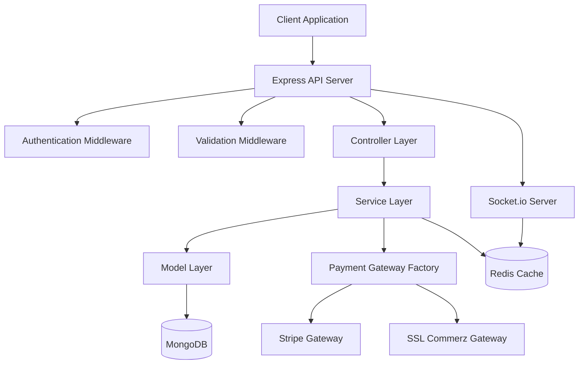
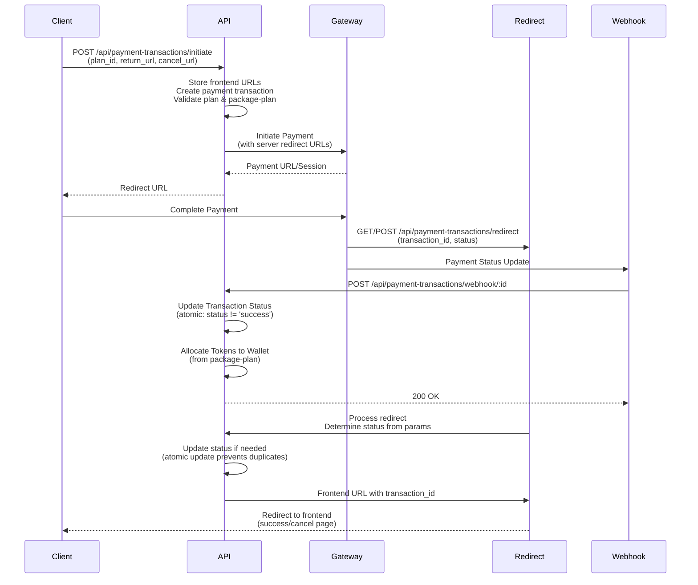

# Payment System Server

A robust, scalable token-based payment system server built with Node.js, Express.js, and TypeScript. This system manages user wallets, token transactions, package purchases, and integrates with multiple payment gateways (Stripe and SSL Commerz) for seamless payment processing.

## 📋 Table of Contents

- [Features](#-features)
- [Tech Stack](#-tech-stack)
- [Architecture](#-architecture)
- [Project Structure](#-project-structure)
- [Database Schema](#-database-schema)
- [API Endpoints](#-api-endpoints)
- [Getting Started](#-getting-started)
- [Environment Variables](#-environment-variables)
- [Payment Gateway Integration](#-payment-gateway-integration)
- [Development](#-development)
- [Deployment](#-deployment)
- [Contributing](#-contributing)

---

## ✨ Features

### Core Functionality

- **User Management**: Complete user authentication and authorization system with role-based access control (7 roles: super-admin, admin, editor, author, contributor, subscriber, user)
- **Authentication**: JWT-based authentication with signup, signin, password reset, email verification, and refresh token support
- **Token-Based System**: Manage user tokens for accessing premium features with complete transaction tracking
- **Package Management**: Create and manage token packages with multiple plans per package, each with its own price, duration, and token amount. Supports multi-currency (USD/BDT), feature associations, type (token/subscription), badge, points, is_initial constraint, and complete history tracking with embedded data
- **Plan Management**: Reusable plan templates (name, duration, description, sequence) that can be associated with multiple packages
- **Package-Plan Management**: Link plans to packages with pricing (USD/BDT), token amounts, is_initial constraint (one per package), and active status
- **Payment Processing**: Integrated payment gateways (Stripe for USD & SSL Commerz for BDT) with webhook support and server-side redirect handling. Requires plan_id for each payment, fetches price from package-plan, and uses atomic updates to prevent duplicate processing
- **Wallet Management**: User wallet system with token balance tracking, expiration dates (calculated from plan duration), package and plan associations, initial package/token tracking, and automatic expiration filtering via pre-find hooks
- **Transaction History**: Complete audit trail for all token and payment transactions with detailed status tracking
- **Feature Access Control**: Define features with parent-child relationships and endpoints with token requirements
- **Profit Management**: Configurable profit percentage settings with complete history tracking
- **Notification System**: Comprehensive notification system with multi-channel support (web, push, email), priority levels, and expiration dates
- **Notification Recipients**: User-specific notification delivery with read status tracking, metadata support, and action buttons
- **Public API Access**: Public endpoints for features, feature-endpoints, packages, and payment methods (no authentication required)
- **Contact Management**: Contact form submission handling
- **Admin Dashboard**: Comprehensive analytics dashboard with statistics, revenue trends, transaction status, payment method performance, token flow, user growth, package performance, and feature performance charts
- **Token Process Module**: Server-to-server token processing system for validating user tokens, checking feature access (only if wallet has package), managing token consumption with automatic profit calculation, and auto-creating wallets if needed

### Technical Features

- **Modular Architecture**: Clean, maintainable codebase with separation of concerns
- **Type Safety**: Full TypeScript implementation with strict type checking
- **Validation**: Zod schema validation for request/response data
- **Error Handling**: Centralized error handling with custom error classes
- **Soft Delete**: Soft delete pattern for data retention with restore and permanent delete capabilities across all modules
- **Query Builders**: Advanced query builders with search, filter, sort, pagination
  - **AppQuery**: Standard Mongoose query builder
  - **AppQueryV2**: Aggregation-based query builder for complex joins and single database hits
- **Webhook Support**: Secure webhook handling for payment status updates
- **Real-time Communication**: Socket.io integration for real-time updates
- **Caching**: Redis integration for performance optimization
- **Session Management**: MongoDB session store for scalable sessions
- **Server-to-Server Authentication**: API key-based authentication middleware for internal service communication
- **Aggregation Pipelines**: MongoDB aggregation for efficient analytics and dashboard data processing
- **Package Plans System**: Multiple plans per package with individual pricing, duration, and token amounts
- **Embedded History**: PackageHistory stores embedded feature and plan data for immutable snapshots (ensures data integrity even if referenced documents are deleted)
- **Server-Side Redirect Handling**: Secure payment gateway redirect processing with atomic status updates and duplicate prevention
- **AppQueryV2**: Aggregation-based query builder for complex joins and single database hits, supporting custom pipeline stages
- **Wallet Expiration Logic**: Automatic filtering of expired wallets via Mongoose pre-find hooks with `$or` condition merging
- **Initial Package/Plan Logic**: Support for initial package and plan designation with atomic constraint enforcement (only one initial per type)

---

## 🛠 Tech Stack

### Core Technologies

- **Runtime**: Node.js
- **Framework**: Express.js 5.x
- **Language**: TypeScript 5.x
- **Database**: MongoDB (Mongoose 8.x)
- **Cache**: Redis 5.x
- **Real-time**: Socket.io 4.x

### Key Libraries

- **Validation**: Zod 3.x
- **Authentication**: JWT (jsonwebtoken)
- **Payment Gateways**: Stripe SDK, SSL Commerz API
- **Email**: Nodemailer
- **File Upload**: Multer
- **Session**: express-session with MongoDB store

### Development Tools

- **Linting**: ESLint
- **Formatting**: Prettier
- **Git Hooks**: Husky
- **Process Manager**: ts-node-dev

---

## 🏗 Architecture

### System Architecture



### Module Architecture

The project follows a **layered architecture pattern** with clear separation of concerns:

```
Request Flow:
Route → Controller → Service → Model → Database
         ↓
    Validation
         ↓
    Error Handling
```

### Module Structure

Each module follows a consistent structure:

```
module-name/
├── module-name.route.ts      # HTTP route definitions
├── module-name.controller.ts # Request handlers
├── module-name.service.ts    # Business logic
├── module-name.model.ts      # Mongoose schema
├── module-name.type.ts       # TypeScript types
└── module-name.validation.ts # Zod validation schemas
```

---

## 📁 Project Structure

```
src/
├── app/
│   ├── builder/              # Core utility classes
│   │   ├── app-error.ts       # Custom error class
│   │   ├── app-query-find.ts       # Standard query builder
│   │   └── app-query-aggregation.ts     # Aggregation-based query builder
│   ├── config/               # Configuration management
│   ├── errors/               # Error handlers
│   │   ├── handle-cast-error.ts
│   │   ├── handle-duplicate-error.ts
│   │   ├── handle-validation-error.ts
│   │   └── handle-zod-error.ts
│   ├── interface/            # TypeScript declarations
│   ├── middlewares/          # Express middlewares
│   │   ├── auth.middleware.ts
│   │   ├── server-auth.middleware.ts
│   │   ├── error.middleware.ts
│   │   ├── validation.middleware.ts
│   │   └── ...
│   ├── modules/              # Feature modules (19 total)
│   │   ├── auth/             # Authentication module
│   │   ├── user/             # User management module
│   │   ├── contact/          # Contact form submissions
│   │   ├── dashboard/        # Admin dashboard analytics
│   │   ├── feature/         # System features management
│   │   ├── feature-endpoint/ # API endpoint definitions
│   │   ├── plan/            # Plan management (reusable templates)
│   │   ├── notification/    # Notification management
│   │   ├── notification-recipient/ # Notification delivery and read status
│   │   ├── package/         # Token package management
│   │   ├── package-plan/    # Package-plan linking
│   │   ├── package-history/ # Package change history
│   │   ├── payment-method/   # Payment gateway configurations
│   │   ├── payment-transaction/ # Payment processing
│   │   ├── token-process/   # Server-to-server token processing
│   │   ├── token-profit/    # Profit percentage settings
│   │   ├── token-profit-history/ # Profit setting history
│   │   ├── token-transaction/ # Token movement tracking
│   │   └── user-wallet/     # User wallet management
│   ├── payment-gateways/     # Payment gateway integrations
│   │   ├── index.ts          # Gateway factory
│   │   ├── stripe/
│   │   └── sslcommerz/
│   ├── redis/                # Redis client setup
│   ├── routes/               # Route registration
│   ├── socket/               # Socket.io setup
│   ├── types/                # Shared types
│   ├── utils/                # Utility functions
│   │   └── with-token-process.ts  # Token process wrapper utility
│   └── token-process/        # Example token-process client (for other servers)
├── app.ts                    # Express app configuration
└── index.ts                  # Application entry point
```

---

## 🗄 Database Schema

### Entity Relationship Diagram

```mermaid
erDiagram
    User {
        ObjectId _id PK "Required, Primary Key"
        string image "Optional, User profile image URL"
        string name "Required, 2-50 characters"
        string email "Required, Unique, Lowercase, Indexed"
        string password "Required, 6-12 characters, Hashed"
        date password_changed_at "Optional, Auto-updated on password change"
        string role "Required, Enum: super-admin | admin | editor | author | contributor | subscriber | user"
        string status "Optional, Enum: in-progress | blocked, Default: in-progress"
        boolean is_verified "Optional, Default: false, Email verification status"
        boolean is_deleted "Optional, Default: false, Soft delete"
        timestamp created_at "Optional, Auto-generated"
        timestamp updated_at "Optional, Auto-generated"
    }

    Feature {
        ObjectId _id PK "Required, Primary Key"
        ObjectId parent FK "Optional, Reference: Feature._id"
        string name "Required"
        string description "Optional"
        string path "Optional, Frontend route path"
        string prefix "Optional, API namespace prefix"
        string type "Optional, Enum: writing | generation | other"
        boolean is_active "Optional, Default: true, Feature availability"
        boolean is_deleted "Optional, Default: false, Soft delete"
        timestamp created_at "Optional, Auto-generated"
        timestamp updated_at "Optional, Auto-generated"
    }

    FeatureEndpoint {
        ObjectId _id PK "Required, Primary Key"
        ObjectId feature FK "Required, Reference: Feature._id"
        string name "Required, API name/label"
        string description "Optional"
        string endpoint "Required, e.g. /api/v1/blog"
        string method "Required, Enum: GET | POST | PUT | PATCH | DELETE"
        number token "Required, Minimum token needed"
        boolean is_active "Optional, Default: true, Endpoint availability"
        boolean is_deleted "Optional, Default: false, Soft delete"
        timestamp created_at "Optional, Auto-generated"
        timestamp updated_at "Optional, Auto-generated"
    }

    Plan {
        ObjectId _id PK "Required, Primary Key"
        string name "Required, 2-100 characters, Indexed"
        string description "Optional, Max 500 characters"
        number duration "Required, Min: 1 day, Indexed"
        number sequence "Optional, For ordering plans"
        boolean is_active "Optional, Default: true, Indexed"
        boolean is_deleted "Optional, Default: false, Soft delete"
        timestamp created_at "Optional, Auto-generated"
        timestamp updated_at "Optional, Auto-generated"
    }

    PackagePlan {
        ObjectId _id PK "Required, Primary Key"
        ObjectId plan FK "Required, Reference: Plan._id, Indexed"
        ObjectId package FK "Required, Reference: Package._id, Indexed"
        object price "Required, Price object with USD and BDT (both >= 0)"
        object previous_price "Optional, Previous price object with USD and BDT"
        number token "Required, Min: 0, Indexed"
        boolean is_initial "Optional, Default: false, Indexed (one per package)"
        boolean is_active "Optional, Default: true, Indexed"
        boolean is_deleted "Optional, Default: false, Soft delete"
        timestamp created_at "Optional, Auto-generated"
        timestamp updated_at "Optional, Auto-generated"
    }

    Package {
        ObjectId _id PK "Required, Primary Key"
        string name "Required, Package title"
        string description "Optional"
        string content "Optional, HTML allowed, Detailed info"
        string type "Optional, Enum: token | subscription, Default: token"
        string badge "Optional, Package badge text"
        array points "Optional, Array of string, Package selling points"
        array features "Required, Reference: Feature._id[]"
        array plans "Optional, Reference: Plan._id[]"
        number sequence "Optional, Default: 0"
        boolean is_initial "Optional, Default: false, Only one package can be initial"
        boolean is_active "Optional, Default: true, Package availability"
        boolean is_deleted "Optional, Default: false, Soft delete"
        timestamp created_at "Optional, Auto-generated"
        timestamp updated_at "Optional, Auto-generated"
    }

    PackageHistory {
        ObjectId _id PK "Required, Primary Key"
        ObjectId package FK "Required, Reference: Package._id"
        string name "Required"
        string description "Optional"
        string content "Optional"
        array features "Required, Embedded feature objects (not references)"
        array plans "Required, Embedded package-plan objects with plan (not references)"
        number sequence "Optional"
        boolean is_active "Optional"
        boolean is_deleted "Optional"
        timestamp created_at "Optional, Auto-generated"
        timestamp updated_at "Optional, Auto-generated"
    }

    PaymentMethod {
        ObjectId _id PK "Required, Primary Key"
        string name "Required, Unique, e.g. Stripe, SSL Commerz"
        string value "Required, Unique, lowercase, e.g. stripe, sslcommerz"
        string currency "Required, 3-letter ISO code"
        string secret "Required, Gateway secret key"
        string public_key "Optional, If required by gateway, e.g. Stripe webhook secret"
        string description "Optional"
        string webhook_url "Optional, Webhook URL for this payment method"
        array currencies "Optional, Array of supported currencies"
        object config "Optional, Additional gateway-specific configuration"
        boolean is_test "Optional, Default: false, Test/sandbox mode"
        boolean is_active "Optional, Default: true, Method availability"
        boolean is_deleted "Optional, Default: false, Soft delete"
        timestamp created_at "Optional, Auto-generated"
        timestamp updated_at "Optional, Auto-generated"
    }

    UserWallet {
        ObjectId _id PK "Required, Primary Key"
        ObjectId user FK "Required, Unique, Reference: User._id, One wallet per user"
        ObjectId package FK "Optional, Reference: Package._id, Purchased package"
        ObjectId plan FK "Optional, Reference: Plan._id, Purchased plan, Indexed"
        number token "Required, Remaining available tokens"
        date expires_at "Optional, Calculated from plan duration"
        boolean initial_token_given "Optional, Default: false"
        boolean is_deleted "Optional, Default: false, Soft delete"
        timestamp created_at "Optional, Auto-generated"
        timestamp updated_at "Optional, Auto-generated"
    }

    TokenTransaction {
        ObjectId _id PK "Required, Primary Key"
        ObjectId user FK "Required, Reference: User._id"
        ObjectId user_wallet FK "Required, Reference: UserWallet._id"
        string type "Required, Enum: increase | decrease"
        number token "Required, Token amount"
        string increase_source "Conditional, Enum: payment | bonus, Only if type = increase"
        ObjectId decrease_source FK "Conditional, Reference: FeatureEndpoint._id, Only if type = decrease"
        ObjectId payment_transaction FK "Conditional, Reference: PaymentTransaction._id, Only if type = increase AND increase_source = payment"
        ObjectId plan FK "Optional, Reference: Plan._id, Indexed"
        boolean is_deleted "Optional, Default: false, Soft delete"
        timestamp created_at "Optional, Auto-generated"
        timestamp updated_at "Optional, Auto-generated"
    }

    PaymentTransaction {
        ObjectId _id PK "Required, Primary Key"
        ObjectId user FK "Required, Reference: User._id"
        ObjectId user_wallet FK "Required, Reference: UserWallet._id"
        string status "Required, Enum: pending | success | failed | refunded"
        ObjectId payment_method FK "Required, Reference: PaymentMethod._id"
        string gateway_transaction_id "Required, Transaction ID from payment gateway, Indexed"
        string gateway_session_id "Optional, Gateway session ID, Indexed"
        string gateway_status "Optional, Gateway-specific status, e.g. paid, VALID, FAILED"
        ObjectId package FK "Required, Reference: Package._id"
        ObjectId plan FK "Required, Reference: Plan._id, Indexed"
        ObjectId price FK "Required, Reference: PackagePlan._id (stores package-plan document _id), Indexed"
        number amount "Required, Payment amount"
        string currency "Required, Enum: USD | BDT, Payment currency"
        string return_url "Required, Frontend return URL (stored, not passed to gateway)"
        string cancel_url "Required, Frontend cancel URL (stored, not passed to gateway)"
        number gateway_fee "Optional, Fee charged by payment gateway"
        string failure_reason "Optional, Reason if payment failed"
        string refund_id "Optional, Gateway refund transaction ID"
        date refunded_at "Optional, Date when refund was processed"
        date paid_at "Optional, Date when payment was completed"
        date failed_at "Optional, Date when payment failed"
        string customer_email "Optional, Customer email from gateway"
        string customer_name "Optional, Customer name from gateway"
        object gateway_response "Optional, Raw response data from gateway for debugging"
        boolean is_deleted "Optional, Default: false, Soft delete"
        timestamp created_at "Optional, Auto-generated"
        timestamp updated_at "Optional, Auto-generated"
    }

    TokenProfit {
        ObjectId _id PK "Required, Primary Key"
        string name "Required, Unique, e.g. Standard Profit"
        number percentage "Required, Profit percentage applied"
        boolean is_active "Optional, Default: true, Active status"
        boolean is_deleted "Optional, Default: false, Soft delete"
        timestamp created_at "Optional, Auto-generated"
        timestamp updated_at "Optional, Auto-generated"
    }

    TokenProfitHistory {
        ObjectId _id PK "Required, Primary Key"
        ObjectId token_profit FK "Required, Reference: TokenProfit._id"
        string name "Required, Profit setting name at that time"
        number percentage "Required, Percentage at that time"
        boolean is_active "Optional"
        boolean is_deleted "Optional"
        timestamp created_at "Optional, Auto-generated"
        timestamp updated_at "Optional, Auto-generated"
    }

    Contact {
        ObjectId _id PK "Required, Primary Key"
        string name "Required, 2-100 characters, Contact person name"
        string email "Required, Valid email format, Indexed"
        string subject "Required, 3-200 characters, Message subject"
        string message "Required, 10-5000 characters, Message content"
        timestamp created_at "Optional, Auto-generated"
        timestamp updated_at "Optional, Auto-generated"
    }

    Notification {
        ObjectId _id PK "Required, Primary Key"
        string title "Required, Notification title"
        string message "Required, Notification message content"
        string type "Required, Enum: request | approval"
        string priority "Optional, Enum: low | medium | high | urgent, Default: medium"
        array channels "Required, Enum: web | push | email[]"
        ObjectId sender FK "Required, Reference: User._id, Notification sender"
        date expires_at "Optional, Default: 1 year from creation"
        string status "Optional, Enum: active | inactive | archived, Default: active"
        boolean is_deleted "Optional, Default: false, Soft delete"
        timestamp created_at "Optional, Auto-generated"
        timestamp updated_at "Optional, Auto-generated"
    }

    NotificationRecipient {
        ObjectId _id PK "Required, Primary Key"
        ObjectId notification FK "Required, Reference: Notification._id"
        ObjectId recipient FK "Required, Reference: User._id, Notification recipient"
        object metadata "Optional, Notification metadata with url, image, source, reference, actions"
        boolean is_read "Optional, Default: false, Read status"
        date read_at "Optional, Date when notification was read"
        boolean is_deleted "Optional, Default: false, Soft delete"
        timestamp created_at "Optional, Auto-generated"
        timestamp updated_at "Optional, Auto-generated"
    }

    %% Relationships
    User ||--o{ UserWallet : "has (One-to-Many)"
    User ||--o{ TokenTransaction : "performs (One-to-Many)"
    User ||--o{ PaymentTransaction : "makes (One-to-Many)"
    UserWallet ||--o{ TokenTransaction : "records (One-to-Many)"
    UserWallet ||--o{ PaymentTransaction : "associated_with (One-to-Many)"
    UserWallet }|--|| Package : "purchased_package (Many-to-One)"
    Feature ||--o{ FeatureEndpoint : "has (One-to-Many)"
    Feature }o--o{ Feature : "parent/child (Self-Referential)"
    Package ||--o{ PackageHistory : "maintains_history (One-to-Many)"
    Package }o--o{ Feature : "includes_features (Many-to-Many)"
    PaymentMethod ||--o{ PaymentTransaction : "used_by (One-to-Many)"
    FeatureEndpoint ||--o{ TokenTransaction : "consumed_by (One-to-Many, via decrease_source)"
    PaymentTransaction ||--o{ TokenTransaction : "triggers (One-to-Many, via payment_transaction)"
    TokenProfit ||--o{ TokenProfitHistory : "maintains_history (One-to-Many)"
    User ||--o{ Notification : "sends (One-to-Many, via sender)"
    Notification ||--o{ NotificationRecipient : "delivered_to (One-to-Many)"
    User ||--o{ NotificationRecipient : "receives (One-to-Many, via recipient)"
```



### Key Relationships

1. **User → UserWallet**: One-to-One (Unique constraint, one wallet per user)
2. **Package → Features**: Many-to-Many (Packages include multiple features)
3. **Package → Plans**: Many-to-Many via PackagePlan (Packages can have multiple plans)
4. **Plan → PackagePlan**: One-to-Many (A plan can be used in multiple packages)
5. **Package → PackagePlan**: One-to-Many (A package can have multiple plans, only one can be initial)
6. **PackagePlan → Plan**: Many-to-One (Package-plan references a plan)
7. **PackagePlan → Package**: Many-to-One (Package-plan belongs to a package)
8. **Feature → FeatureEndpoint**: One-to-Many (Each feature has multiple endpoints)
9. **UserWallet → TokenTransaction**: One-to-Many (Wallet records all token movements)
10. **UserWallet → Package**: Many-to-One (Wallet can reference a purchased package)
11. **UserWallet → Plan**: Many-to-One (Wallet can reference a purchased plan)
12. **PaymentTransaction → TokenTransaction**: One-to-Many (Payment triggers token increase)
13. **PaymentTransaction → Plan**: Many-to-One (Each payment is for a specific plan)
14. **PaymentTransaction → PackagePlan**: Many-to-One (Each payment references a package-plan for price)
15. **TokenTransaction → Plan**: Many-to-One (Token transactions can reference a plan)
16. **User → Notification**: One-to-Many (Users can send multiple notifications)
17. **Notification → NotificationRecipient**: One-to-Many (Notifications can have multiple recipients)
18. **User → NotificationRecipient**: One-to-Many (Users can receive multiple notifications)

---

## 🔌 API Endpoints

### Base URL

```
/api
```

### Available Modules

| Module                  | Base Path                      | Description                           |
| ----------------------- | ------------------------------ | ------------------------------------- |
| Auth                    | `/api/auth`                    | Authentication and authorization      |
| Users                   | `/api/users`                   | User management                       |
| Contact                 | `/api/contact`                 | Contact form submissions              |
| Features                | `/api/features`                | System features management            |
| Feature Endpoints       | `/api/feature-endpoints`       | API endpoint definitions              |
| Plans                   | `/api/plans`                   | Plan management (reusable templates)  |
| Packages                | `/api/packages`                | Token package management              |
| Package Plans           | `/api/package-plans`           | Package-plan linking                  |
| Package History         | `/api/package-histories`       | Package change history                |
| Payment Methods         | `/api/payment-methods`         | Payment gateway configurations        |
| Payment Transactions    | `/api/payment-transactions`    | Payment processing                    |
| Token Profits           | `/api/token-profits`           | Profit percentage settings            |
| Token Profit History    | `/api/token-profit-histories`  | Profit setting history                |
| Token Transactions      | `/api/token-transactions`      | Token movement history                |
| Token Process           | `/api/token-process`           | Server-to-server token processing     |
| User Wallets            | `/api/user-wallets`            | User wallet management                |
| Notifications           | `/api/notifications`           | Notification management               |
| Notification Recipients | `/api/notification-recipients` | Notification delivery and read status |
| Dashboard               | `/api/dashboard`               | Admin dashboard analytics             |

### Common Endpoints Pattern

Most modules follow RESTful conventions:

- `GET /api/{module}` - List all (with pagination, search, filter)
- `GET /api/{module}/:id` - Get single item
- `POST /api/{module}` - Create new item
- `PATCH /api/{module}/:id` - Update item
- `DELETE /api/{module}/:id` - Soft delete item

### Auth-Specific Endpoints

- `POST /api/auth/signin` - User sign in
- `POST /api/auth/signup` - User sign up
- `POST /api/auth/refresh-token` - Refresh access token
- `PATCH /api/auth/change-password` - Change password (authenticated)
- `POST /api/auth/forget-password` - Request password reset
- `PATCH /api/auth/reset-password` - Reset password with token
- `POST /api/auth/email-verification-source` - Request email verification (authenticated)
- `POST /api/auth/email-verification` - Verify email with token

### User-Specific Endpoints

- `GET /api/users/self` - Get current user profile (authenticated)
- `GET /api/users/writers` - Get writers list (public)
- `GET /api/users` - Get all users (admin only)
- `GET /api/users/:id` - Get user by ID (admin only)
- `PATCH /api/users/self` - Update own profile (authenticated)
- `PATCH /api/users/bulk` - Bulk update users (admin only)
- `PATCH /api/users/:id` - Update user by ID (admin only)
- `DELETE /api/users/:id` - Soft delete user (admin only)
- `DELETE /api/users/bulk` - Bulk soft delete users (admin only)
- `DELETE /api/users/:id/permanent` - Permanently delete user (admin only)
- `DELETE /api/users/bulk/permanent` - Bulk permanent delete (admin only)
- `POST /api/users/:id/restore` - Restore soft-deleted user (admin only)
- `POST /api/users/bulk/restore` - Bulk restore users (admin only)

### Public Endpoints (No Authentication Required)

These endpoints are available for client-side access without authentication:

- `GET /api/features/public` - Get all active public features
- `GET /api/features/:id/public` - Get single public feature by ID
- `GET /api/feature-endpoints/public` - Get all active public feature endpoints
- `GET /api/feature-endpoints/:id/public` - Get single public feature endpoint by ID
- `GET /api/plans/public` - Get all active public plans
- `GET /api/packages/public` - Get all active public packages (supports `plans` query parameter for filtering by plan ID, uses AppQueryV2 aggregation)
- `GET /api/packages/:id/public` - Get single public package by ID (with populated plans from package-plans)
- `GET /api/payment-methods/public` - Get all active public payment methods
- `GET /api/payment-methods/:id/public` - Get single public payment method by ID
- `GET /api/users/writers` - Get public writers list

### Payment-Specific Endpoints

- `POST /api/payment-transactions/initiate` - Initiate payment (authenticated, requires `plan_id`, `return_url`, `cancel_url` in request body)
- `GET/POST /api/payment-transactions/redirect` - Redirect handler (no auth, called by payment gateways, processes status and redirects to frontend)
- `POST /api/payment-transactions/webhook/:payment_method_id` - Webhook handler (no auth, signature verified)
- `GET /api/payment-transactions/:id/status` - Check payment status (authenticated)
- `POST /api/payment-transactions/:id/verify` - Verify payment (authenticated, uses transaction document `_id`)

### Notification-Specific Endpoints

- `GET /api/notifications` - Get all notifications (admin only)
- `GET /api/notifications/:id` - Get single notification (admin only)
- `POST /api/notifications` - Create notification (admin only)
- `PATCH /api/notifications/:id` - Update notification (admin only)
- `PATCH /api/notifications/bulk` - Bulk update notifications (admin only)
- `DELETE /api/notifications/:id` - Soft delete notification (admin only)
- `DELETE /api/notifications/bulk` - Bulk soft delete notifications (admin only)
- `POST /api/notifications/:id/restore` - Restore notification (admin only)
- `POST /api/notifications/bulk/restore` - Bulk restore notifications (admin only)

### Notification Recipient-Specific Endpoints

- `GET /api/notification-recipients` - Get all notification recipients (admin only)
- `GET /api/notification-recipients/self` - Get own notification recipients (admin/user)
- `GET /api/notification-recipients/:id` - Get single notification recipient (admin only)
- `GET /api/notification-recipients/:id/self` - Get own notification recipient by ID (admin/user)
- `POST /api/notification-recipients` - Create notification recipient (admin/user)
- `PATCH /api/notification-recipients/:id/read` - Mark notification as read (admin/user)
- `PATCH /api/notification-recipients/read-all/self` - Mark all own notifications as read (admin/user)
- `PATCH /api/notification-recipients/bulk/self` - Bulk update own notification recipients (admin/user)
- `DELETE /api/notification-recipients/:id` - Soft delete notification recipient (admin only)
- `DELETE /api/notification-recipients/bulk` - Bulk soft delete notification recipients (admin only)
- `POST /api/notification-recipients/:id/restore` - Restore notification recipient (admin only)
- `POST /api/notification-recipients/bulk/restore` - Bulk restore notification recipients (admin only)
- `POST /api/notification-recipients/bulk/restore/self` - Bulk restore own notification recipients (admin/user)

### Dashboard-Specific Endpoints

- `GET /api/dashboard/statistics` - Get overall dashboard statistics (admin/super-admin only)
- `GET /api/dashboard/revenue?period=30d` - Get revenue trend data (admin/super-admin only)
- `GET /api/dashboard/transactions` - Get transaction status distribution (admin/super-admin only)
- `GET /api/dashboard/payment-methods` - Get payment method performance (admin/super-admin only)
- `GET /api/dashboard/token-flow?period=30d` - Get token flow data (admin/super-admin only)
- `GET /api/dashboard/user-growth?period=30d` - Get user growth data (admin/super-admin only)
- `GET /api/dashboard/packages` - Get package performance data (admin/super-admin only)
- `GET /api/dashboard/features` - Get feature performance data (admin/super-admin only)

### Token Process-Specific Endpoints

- `POST /api/token-process/start` - Start token process (server-to-server authentication required)
- `POST /api/token-process/end` - End token process and update wallet (server-to-server authentication required)

### Package-Specific Endpoints

- `POST /api/packages/give-initial-package` - Give initial package to user as bonus (server-to-server authentication required)
- `PATCH /api/packages/:id/is-initial` - Update package is_initial status (admin only, ensures only one is initial)

### User Wallet-Specific Endpoints

- `POST /api/user-wallets/give-initial-token` - Give initial token to user (server-to-server authentication required, supports optional duration parameter)

---

## 🚀 Getting Started

### Prerequisites

- Node.js (v18 or higher)
- MongoDB (v6 or higher)
- Redis (v6 or higher) - Optional but recommended
- pnpm (or npm/yarn)

### Installation

1. **Clone the repository**

   ```bash
   git clone <repository-url>
   cd payment-system-server
   ```

2. **Install dependencies**

   ```bash
   pnpm install
   # or
   npm install
   ```

3. **Set up environment variables**

   ```bash
   cp .env.example .env
   # Edit .env with your configuration
   ```

4. **Build the project**

   ```bash
   pnpm build
   # or
   npm run build
   ```

5. **Start the development server**

   ```bash
   pnpm start:dev
   # or
   npm run start:dev
   ```

6. **Start the production server**
   ```bash
   pnpm start
   # or
   npm run start
   ```

The server will start on `http://localhost:5000` (or the port specified in your `.env` file).

---

## 🔐 Environment Variables

Create a `.env` file in the root directory with the following variables:

### Server Configuration

```env
NODE_ENV=development
PORT=5000
URL=http://localhost:5000
CLUSTER_ENABLED=false
```

### Database

```env
DATABASE_URL=mongodb://localhost:27017/payment-system
```

### Redis (Optional)

```env
REDIS_ENABLED=true
REDIS_URL=redis://localhost:6379
REDIS_PASSWORD=
```

### Authentication

```env
JWT_ACCESS_SECRET=your-access-secret-key
JWT_ACCESS_SECRET_EXPIRES_IN=7d
JWT_REFRESH_SECRET=your-refresh-secret-key
JWT_REFRESH_SECRET_EXPIRES_IN=30d
JWT_RESET_PASSWORD_SECRET=your-reset-password-secret
JWT_RESET_PASSWORD_SECRET_EXPIRES_IN=1h
JWT_EMAIL_VERIFICATION_SECRET=your-email-verification-secret
JWT_EMAIL_VERIFICATION_SECRET_EXPIRES_IN=24h
SESSION_SECRET=your-session-secret
```

### Frontend & Email

```env
FRONT_END_URL=http://localhost:3000
RESET_PASSWORD_UI_LINK=http://localhost:3000/reset-password
EMAIL_VERIFICATION_UI_LINK=http://localhost:3000/verify-email
AUTH_USER_EMAIL=your-email@gmail.com
AUTH_USER_EMAIL_PASSWORD=your-app-password
```

### Security

```env
BCRYPT_SALT_ROUNDS=12
DEFAULT_PASSWORD=default-password
SERVER_API_KEY=your-server-api-key-for-internal-services
```

**Note**: Generate secure random strings for JWT secrets:

```bash
node -e "console.log(require('crypto').randomBytes(32).toString('hex'))"
```

---

## 💳 Payment Gateway Integration

### Supported Gateways

1. **Stripe** - International payments (USD)
2. **SSL Commerz** - Bangladesh payments (BDT)

### Payment Flow



### Payment Gateway Factory

The system uses a factory pattern to support multiple payment gateways:

```typescript
import { PaymentGatewayFactory } from './app/payment-gateways';

const gateway = PaymentGatewayFactory.create(paymentMethod);
const response = await gateway.initiatePayment(data);
```

### Webhook Configuration

1. **Stripe**: Configure webhook endpoint in Stripe Dashboard
2. **SSL Commerz**: Configure webhook URL in SSL Commerz panel

Webhook URL format:

```
POST /api/payment-transactions/webhook/:payment_method_id
```

### Redirect Handling

The system implements **server-side redirect handling** for enhanced security and reliability:

**Flow**:

1. Frontend provides `return_url` and `cancel_url` during payment initiation
2. Server stores these URLs in the payment transaction document
3. Server constructs its own redirect URLs: `/api/payment-transactions/redirect?transaction_id={id}&status=success/cancel`
4. Server passes these redirect URLs to the payment gateway
5. Gateway redirects to server's redirect endpoint after payment
6. Server processes payment status, updates transaction atomically, then redirects to stored frontend URL

**Redirect Endpoint**:

```
GET/POST /api/payment-transactions/redirect?transaction_id={id}&status={status}
```

**Features**:

- Supports both GET (SSLCommerz) and POST (Stripe) redirects
- Extracts transaction ID from various gateway parameters (`transaction_id`, `tran_id`, `val_id`)
- Determines payment status from gateway parameters
- Uses atomic updates to prevent duplicate processing
- Appends correct `transaction_id` (MongoDB `_id`) to frontend redirect URL
- Updates stored URLs in transaction document for consistency

**Benefits**:

- Centralized payment status processing
- Secure handling of payment callbacks
- Consistent transaction ID format (always MongoDB `_id`)
- Prevents duplicate processing with atomic operations
- Works seamlessly with both Stripe and SSLCommerz

### Adding a New Payment Gateway

1. Create a new service in `src/app/payment-gateways/`
2. Implement the `IPaymentGateway` interface
3. Add the gateway to `PaymentGatewayFactory`
4. Update `PaymentMethod` model validation

---

## 📊 Admin Dashboard

The dashboard module provides comprehensive analytics for administrators:

### Dashboard Statistics

- **Total Revenue**: Aggregated revenue in USD and BDT with USD equivalent
- **Total Users**: Count of active users (excluding blocked and deleted)
- **Total Transactions**: Count of all payment transactions
- **Total Tokens**: Sum of tokens across all active user wallets
- **Trends**: Month-over-month percentage changes for all metrics

### Dashboard Charts

1. **Revenue Trend**: Daily revenue over time (USD and BDT)
2. **Transaction Status**: Distribution of transactions by status (bar chart)
3. **Payment Method Performance**: Transaction count and revenue by payment method
4. **Token Flow**: Daily token increases vs decreases
5. **User Growth**: Daily user registrations
6. **Package Performance**: Purchase count and revenue per package
7. **Feature Performance**: Usage count and total tokens used per feature

### Data Aggregation

All dashboard data is generated using MongoDB aggregation pipelines for optimal performance:

- Efficient data joining across collections
- Real-time calculations
- Period-based filtering (7d, 30d, 90d, 1y)
- Trend calculations with month-over-month comparisons

---

## 🔄 Token Process Module

The token process module provides server-to-server token processing for external services:

### Features

- **Wallet Auto-Creation**: Automatically creates wallet if user doesn't have one (with 0 tokens, no package)
- **Token Validation**: Validates user tokens against feature endpoint requirements
- **Feature Access Check**: Verifies if user's package includes the requested feature (only if wallet has a package)
- **Package Validation Skip**: If wallet has no package, skips package feature validation and only checks token amount
- **Token Consumption**: Calculates final cost including profit percentages (sum of all active profit percentages) and updates wallet
- **Server-to-Server Auth**: API key-based authentication for secure internal communication
- **Negative Balance Support**: Allows negative token balances for adjustment during next purchase
- **Atomic Operations**: Uses MongoDB transactions for atomic wallet updates and token transaction creation
- **API-Friendly Responses**: Returns status objects instead of throwing errors for easier integration

### API Endpoints

**Start Token Process** (`POST /api/token-process/start`):

- Creates wallet if user doesn't have one (with 0 tokens)
- Validates user wallet exists and is not expired
- Checks if feature endpoint is included in user's package (only if wallet has a package)
- Validates user has sufficient tokens
- Returns access status with user token balance
- Returns API-friendly responses (doesn't throw errors, returns status objects)

**End Token Process** (`POST /api/token-process/end`):

- Calculates final cost with profit percentage (sum of all active profit percentages)
- Uses MongoDB transaction for atomic wallet update and token transaction creation
- Creates token transaction record (decrease type)
- Updates user wallet balance atomically (allows negative for adjustment)
- Returns updated token balance and final cost

### Usage Example

```typescript
// From another server
import axios from 'axios';

const startResult = await axios.post(
  'http://payment-server/api/token-process/start',
  {
    user_id: 'user_id_here',
    feature_endpoint_id: 'feature_endpoint_id_here',
  },
  {
    headers: {
      'x-server-api-key': 'your-server-api-key',
    },
  },
);

// Execute your service logic
const serviceResult = await yourServiceFunction();

// End token process
await axios.post(
  'http://payment-server/api/token-process/end',
  {
    user_id: 'user_id_here',
    feature_endpoint_id: 'feature_endpoint_id_here',
    cost: serviceResult.cost,
  },
  {
    headers: {
      'x-server-api-key': 'your-server-api-key',
    },
  },
);
```

### withTokenProcess Wrapper

A utility wrapper is available for wrapping service functions:

```typescript
import { withTokenProcess } from './utils/withTokenProcess';

const wrappedService = withTokenProcess(
  {
    feature_endpoint_id: 'feature_endpoint_id',
    user_id: (args) => args[0].user_id, // Extract from arguments
  },
  yourServiceFunction,
);

// Usage
const result = await wrappedService({ user_id: 'user_id', ...otherData });
```

---

## 💻 Development

### Available Scripts

```bash
# Development
pnpm start:dev          # Start development server with hot reload
pnpm build              # Build TypeScript to JavaScript
pnpm start              # Start production server

# Code Quality
pnpm lint               # Run ESLint
pnpm lint:fix           # Fix ESLint errors
pnpm prettier           # Format code with Prettier
pnpm prettier:fix       # Auto-fix Prettier issues

# Docker
pnpm docker:dev         # Start development Docker containers
pnpm docker:dev:stop    # Stop development containers
pnpm docker:prod        # Start production Docker containers
```

### Code Style

- **TypeScript**: Strict mode enabled
- **Linting**: ESLint with TypeScript rules
- **Formatting**: Prettier
- **Git Hooks**: Husky for pre-commit checks

### Module Creation

Follow the existing module pattern:

1. Create module directory in `src/app/modules/`
2. Create required files (route, controller, service, model, type, validation)
3. Register route in `src/app/routes/index.ts`
4. Follow naming conventions and patterns

See `documents/EXECUTION_GUIDE.md` for detailed module generation instructions.

For comprehensive project analysis and payment process documentation, see:

- `PAYMENT_PROCESS_ANALYSIS.md` - Complete payment flow analysis with duplicate prevention and security measures
- `FULL_PROJECT_ANALYSIS.md` - Full project analysis with all modules, edge cases, and production readiness checklist

---

## 🚢 Deployment

### Docker Deployment

```bash
# Development
pnpm docker:dev

# Production
pnpm docker:prod
```

### Environment-Specific Configuration

- **Development**: Use `.env` file
- **Production**: Set environment variables in your hosting platform
- **Docker**: Use `docker-compose.yml` for container orchestration

### Production Checklist

- [ ] Set `NODE_ENV=production`
- [ ] Configure secure JWT secrets
- [ ] Set up MongoDB connection string
- [ ] Configure Redis (if enabled)
- [ ] Set up payment gateway credentials
- [ ] Configure webhook URLs
- [ ] Enable HTTPS
- [ ] Set up monitoring and logging
- [ ] Configure CORS for production domain
- [ ] Set up backup strategy for MongoDB

---

## 🤝 Contributing

1. Fork the repository
2. Create a feature branch (`git checkout -b feature/amazing-feature`)
3. Commit your changes (`git commit -m 'Add some amazing feature'`)
4. Push to the branch (`git push origin feature/amazing-feature`)
5. Open a Pull Request

### Code Standards

- Follow existing code patterns and conventions
- Write TypeScript with strict type checking
- Add validation for all inputs
- Write meaningful commit messages
- Update documentation for new features

---

## 📝 License

This project is licensed under the ISC License.

---

## 📞 Support

For support, email your-email@example.com or open an issue in the repository.

---

## 🙏 Acknowledgments

- Express.js team for the excellent framework
- MongoDB team for Mongoose ODM
- Stripe and SSL Commerz for payment gateway APIs
- All contributors and maintainers

---

**Built with ❤️ using TypeScript, Express.js, and MongoDB**
