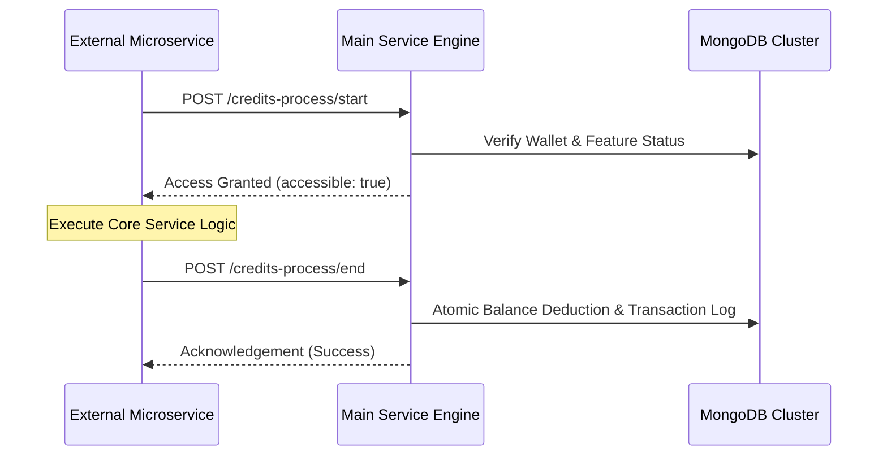

# Credits Process API Guide

The Credits Process API provides a high-performance orchestration layer for validating user credits, verifying feature entitlements, and processing atomic balance consumption for asynchronous services.

---

## 📋 Table of Contents

- [Credits Process API Guide](#credits-process-api-guide)
  - [📋 Table of Contents](#-table-of-contents)
  - [🎯 Overview](#-overview)
  - [🏗️ System Flow](#️-system-flow)
  - [🔑 Authentication](#-authentication)
  - [📡 API Endpoints](#-api-endpoints)
    - [1. Start Credits Process](#1-start-credits-process)
    - [2. End Credits Process \[Recomended for end process, Single Model Or Multi-Model this can useable both case. Always Prefer This method\]](#2-end-credits-process-recomended-for-end-process-single-model-or-multi-model-this-can-useable-both-case-always-prefer-this-method)
    - [2. End Credits Process \[Not recomended for end process, its have for only legacy purpose \]](#2-end-credits-process-not-recomended-for-end-process-its-have-for-only-legacy-purpose-)
  - [⚠️ Error Handling](#️-error-handling)
  - [💡 Best Practices](#-best-practices)

---

## 🎯 Overview

The Credits Process workflow is designed to ensure financial integrity for service-based environments (like AI generations) where the final cost is calculated post-execution.

1. **Start Phase**: Validates if the user has a sufficient "holding balance" and permission to access the requested feature.
2. **End Phase**: Finalizes the transaction by calculating the actual cost based on telemetry (input/output/model metrics) and performs the atomic balance deduction.

---

## 🏗️ System Flow

<div align="center">



</div>

---

## 🔑 Authentication

All requests to the Credits Process API must include the `x-server-api-key` header for server-to-server authentication.

```bash
x-server-api-key: <YOUR_SERVER_API_KEY>
Content-Type: application/json
```

---

## 📡 API Endpoints

### 1. Start Credits Process

Checks user wallet existence, package expiration, and minimum credit requirements.

**Endpoint**: `POST /api/credits-process/start`

**Request Body**:

```json
{
  "user_id": "64f1a2b3c4d5e6f7a8b9c0d1",
  "feature_endpoint_id": "64f1a2b3c4d5e6f7a8b9c0d2"
}
```

**Success Response (Status 200)**:

```typescript
type TCreditsProcessStartResponse = {
  success: boolean;
  message: string;
  data: {
    user_id: string;
    usage_key?: string; // Generated session UUID
    credits: number; // Current balance
    status: 'accessible' | 'not-accessible';
    message?: string; // Reason if not-accessible
  };
};
```

**Example Response**:

```json
{
  "success": true,
  "message": "Credits process started successfully",
  "data": {
    "usage_key": "550e8400-e29b-41d4-a716-446655440000",
    "user_id": "64f1a2b3c4d5e6f7a8b9c0d1",
    "credits": 5000,
    "status": "accessible"
  }
}
```

---

### 2. End Credits Process [Recomended for end process, Single Model Or Multi-Model this can useable both case. Always Prefer This method]

Used for services utilizing multiple models within a single execution block.

**Endpoint**: `POST /api/credits-process/end-multimodel`

**Request Body**:

```json
{
  "usage_key": "550e8400-e29b-41d4-a716-446655440000",
  "user_id": "64f1a2b3c4d5e6f7a8b9c0d1",
  "feature_endpoint_id": "64f1a2b3c4d5e6f7a8b9c0d2",
  "usages": [
    {
      "input_tokens": 100,
      "output_tokens": 200,
      "ai_model": "gpt-4"
    },
    {
      "input_tokens": 50,
      "output_tokens": 300,
      "ai_model": "claude-3-opus"
    }
  ]
}
```

**Success Response (Status 200)**:

```typescript
type TCreditsProcessEndMultimodelResponse = {
  success: boolean;
  message: string;
  data: {
    user_id: string;
    usage_key?: string;
    credits: number; // Updated wallet credits
    status: 'returnable';
    message: string;
    details: Array<{
      credit_price: number;
      ai_model?: string;
      input_tokens: number;
      output_tokens: number;
      input_credits: number;
      output_credits: number;
      input_token_price: number;
      output_token_price: number;
      profit_credits_percentage: number;
      profit_credits: number;
      cost_credits: number;
      cost_price: number;
      credits: number; // Total credits deducted (cost + profit + rounding)
      price: number; // Total price in USD
      rounding_credits: number; // Surplus credits from rounding
      rounding_price: number; // Surplus price from rounding
    }>;
  };
};
```

**Example Response**:

```json
{
  "success": true,
  "message": "Multi-model credits process ended successfully",
  "data": {
    "usage_key": "550e8400-e29b-41d4-a716-446655440000",
    "user_id": "64f1a2b3c4d5e6f7a8b9c0d1",
    "credits": 4400,
    "message": "Multi-model credits processed successfully",
    "status": "returnable",
    "details": [
      {
        "credit_price": 0.00001,
        "ai_model": "gpt-4",
        "input_tokens": 100,
        "output_tokens": 200,
        "input_credits": 300,
        "output_credits": 1200,
        "input_token_price": 0.00003,
        "output_token_price": 0.00006,
        "profit_credits_percentage": 10,
        "profit_credits": 150,
        "cost_credits": 1500,
        "cost_price": 0.015,
        "credits": 1650,
        "price": 0.0165,
        "rounding_credits": 0,
        "rounding_price": 0
      }
    ]
  }
}
```

---

### 2. End Credits Process [Not recomended for end process, its have for only legacy purpose ]

Calculates final cost based on telemetry and deducts credits atomically.

**Endpoint**: `POST /api/credits-process/end`

**Request Body**:

```json
{
  "usage_key": "550e8400-e29b-41d4-a716-446655440000",
  "user_id": "64f1a2b3c4d5e6f7a8b9c0d1",
  "feature_endpoint_id": "64f1a2b3c4d5e6f7a8b9c0d2",
  "input_tokens": 150,
  "output_tokens": 450,
  "ai_model": "gpt-4-turbo"
}
```

**Success Response (Status 200)**:

```typescript
type TCreditsProcessEndResponse = {
  success: boolean;
  message: string;
  data: {
    user_id: string;
    usage_key?: string;
    credits: number; // Updated wallet credits
    status: 'returnable';
    message: string;
    details: {
      credit_price: number;
      ai_model?: string;
      input_tokens: number;
      output_tokens: number;
      input_credits: number;
      output_credits: number;
      input_token_price: number;
      output_token_price: number;
      profit_credits_percentage: number;
      profit_credits: number;
      cost_credits: number;
      cost_price: number;
      credits: number; // Total credits deducted (cost + profit + rounding)
      price: number; // Total price in USD
      rounding_credits: number; // Surplus credits from rounding
      rounding_price: number; // Surplus price from rounding
    };
  };
};
```

**Example Response**:

```json
{
  "success": true,
  "message": "Credits process ended successfully",
  "data": {
    "usage_key": "550e8400-e29b-41d4-a716-446655440000",
    "user_id": "64f1a2b3c4d5e6f7a8b9c0d1",
    "credits": 4400,
    "message": "Credits processed successfully",
    "status": "returnable",
    "details": {
      "credit_price": 0.00001,
      "ai_model": "gpt-4-turbo",
      "input_tokens": 150,
      "output_tokens": 450,
      "input_credits": 4.5,
      "output_credits": 112.5,
      "input_token_price": 0.0000003,
      "output_token_price": 0.0000025,
      "profit_credits_percentage": 10,
      "profit_credits": 11.7,
      "cost_credits": 117,
      "cost_price": 0.00117,
      "credits": 129,
      "price": 0.00129,
      "rounding_credits": 0.3,
      "rounding_price": 0.000003
    }
  }
}
```

---

## ⚠️ Error Handling

| Scenario               | Message                  | Status Code             |
| :--------------------- | :----------------------- | :---------------------- |
| **Invalid Key**        | "Invalid server API key" | 401                     |
| **Insufficient Funds** | "Insufficient credits"   | 200 (accessible: false) |
| **Expired Package**    | "Package expired"        | 200 (accessible: false) |
| **Feature Locked**     | "Feature not in package" | 403                     |

**Inaccessible Response Example**:

```json
{
  "success": true,
  "data": {
    "status": "not-accessible",
    "credits": 45,
    "message": "Insufficient credit balance for this feature."
  }
}
```

---

## 💡 Best Practices

1. **Pre-Check Always**: Never execute the core service (e.g., calling OpenAI) before receiving `accessible: true` from the **Start** endpoint.
2. **Handle End-Failures Gracefully**: If the **End** API fails (network error), log the failure but do not block the user result since the service was already rendered.
3. **Usage Key Correlation**: The system generates a `usage_key` in the **Start** phase. Use this for correlating logs across microservices.
4. **Environment Safety**: Ensure `SERVER_API_KEY` is never exposed to the frontend; this is a strictly Server-to-Server protocol.

---

**Version**: 4.0.0
**Last Updated**: 2026-01-15
