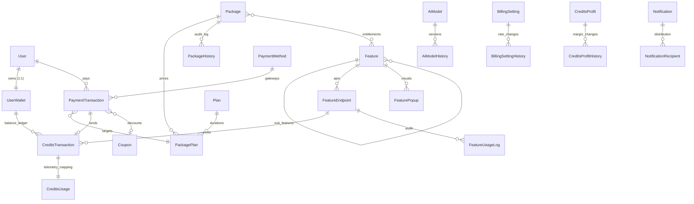

# Execution Guide - Main Service Engine (Omni-Channel)

This document provides exhaustive technical documentation for all core models, their relational architecture, and systematic instructions for modular feature generation within the engine.

---

## 📋 Table of Contents

- [Core Models Documentation](#core-models-documentation)
- [Entity Relationship Diagram (ERD)](#entity-relationship-diagram-erd)
- [Module Generation Standards](#module-generation-standards)
- [System Life-Cycles & Workflows](#system-life-cycles--workflows)

---

## Core Models Documentation

### 👤 User

Central identity management with multi-source authentication (Email/Google) and RBAC.

**Fields**

- `_id` — ObjectId
- `image` — String (Optional, Profile URL)
- `name` — String (Required, 2-50 characters)
- `email` — String (Required, Unique, Lowercase, Indexed)
- `password` — String (Required for email source, Hashed, Select: false)
- `password_changed_at` — Date (Auto-updated, Select: false)
- `role` — Enum: `super-admin | admin | editor | author | contributor | subscriber | user` (Required)
- `status` — Enum: `in-progress | blocked` (Default: `in-progress`)
- `auth_source` — Enum: `email | google` (Default: `email`)
- `google_id` — String (Optional, Indexed)
- `is_verified` — Boolean (Email verification status)
- `is_deleted` — Boolean (Soft delete, Select: false)
- `created_at`, `updated_at` — Auto-generated timestamps

**Special Features**

- BCrypt Hashing: Automatic password hashing on save.
- SSO Integration: Partial filter indexing for Google ID to allow safe multi-method sign-in.
- Email Reset: `is_verified` flips to false automatically on email modification.
- Static Helpers: `isUserExist(_id)` and `isUserExistByEmail(email)` with automatic field hydration (+password).
- Instance Methods: `softDelete()` for logical record removal.

---

### 👛 UserWallet

Atomic ledger container for a user's credit balance and subscription status.

**Fields**

- `_id` — ObjectId
- `user` — ObjectId (Ref: User, Unique, Required)
- `email` — String (Indexed, for fast lookup)
- `package` — ObjectId (Ref: Package, Current active package)
- `plan` — ObjectId (Ref: Plan, Current active duration)
- `credits` — Number (Required, Min: 0, Atomic Balance)
- `expires_at` — Date (Subscription expiry)
- `initial_credits_given` — Boolean (Onboarding flag)
- `initial_package_given` — Boolean
- `type` — Enum: `free | paid` (Default: `free`)
- `is_deleted` — Boolean (Select: false)

**Special Features**

- Expiration Middleware: Pre-find hook automatically checks `expires_at` and treats expired wallets as "out of credits" unless bypassed.
- Atomic Integrity: All balance changes MUST use `$inc` to prevent race conditions.

---

### 🔄 CreditsTransaction

Immutable history of all credit movements (Inflow/Outflow).

**Fields**

- `_id` — ObjectId
- `user` — ObjectId (Ref: User, Required)
- `email` — String (Indexed)
- `user_wallet` — ObjectId (Ref: UserWallet, Required)
- `type` — Enum: `increase | decrease` (Required)
- `credits` — Number (Requirement: >= 0)
- `increase_source` — Enum: `payment | bonus` (Required if type is increase)
- `decrease_source` — ObjectId (Ref: FeatureEndpoint, Required if type is decrease)
- `payment_transaction` — ObjectId (Ref: PaymentTransaction, For payment-source increases)
- `plan` — ObjectId (Ref: Plan, For audit trail)
- `usage_key` — String (Correlation ID for telemetry logs)
- `is_deleted` — Boolean

---

### 📊 CreditsUsage

Technical telemetry mapping real-world service usage to balance consumption.

**Fields**

- `user`, `user_wallet` — ObjectIds
- `email`, `usage_key` — Strings (Indexed)
- `credits_transaction` — ObjectId (Ref: CreditsTransaction)
- `ai_model` — String (Identifier like `gpt-4`)
- `input_tokens`, `output_tokens` — Numbers (Operational metrics)
- `input_credits`, `output_credits` — Numbers (Calculated cost)
- `profit_credits`, `cost_credits`, `cost_price` — Numbers (Internal financial auditing, Select: false)

---

### 🧩 Feature

High-level service capability hierarchy.

**Fields**

- `name` — String (Required)
- `value` — String (Unique slug, Required)
- `parent` — ObjectId (Self-Reference mapping sub-features)
- `description`, `path`, `prefix` — Strings
- `type` — Enum: `writing | generation | other`
- `max_word` — Object: `{ free: Number, paid: Number }` (Tiered limits)
- `sequence` — Number (Order)
- `is_active`, `is_deleted` — Booleans

---

### 🔗 FeatureEndpoint

Low-level API path mapping with specific credit costs.

**Fields**

- `feature` — ObjectId (Ref: Feature, Required)
- `name`, `value` — String (Required)
- `endpoint` — String (API path)
- `method` — Enum: `GET | POST | PUT | PATCH | DELETE`
- `credits` — Number (Consumable cost per hit)
- `max_word` — Object: `{ free: Number, paid: Number }`
- `is_active`, `is_deleted` — Booleans

---

### 🖼️ FeaturePopup

Dynamic UI triggers (Modals/Popups) associated with specific features.

**Fields**

- `feature` — ObjectId (Ref: Feature)
- `name`, `value` — Strings (Unique slugs)
- `image`, `video`, `content` — Strings (Media assets)
- `actions` — Array of Objects: `{ name, path, type, variant, size, position }`
- `category` — Enum: `single-time | multi-time`
- `priority`, `delay`, `duration` — Numbers

---

### 🎁 Package

Tiered product offering containing features and multiple price plans.

**Fields**

- `name`, `value` — Strings (Slugs)
- `description`, `content`, `badge` — Strings
- `type` — Enum: `credits | subscription`
- `points` — Array of Strings (Selling points)
- `features` — Array of ObjectIds (Ref: Feature)
- `plans` — Array of ObjectIds (Ref: Plan)
- `is_initial` — Boolean (System onboarding package)
- `is_active`, `is_deleted` — Booleans

---

### 💰 PackagePlan

Relational bridge defining the specific price and credits for a Package + Plan pair.

**Fields**

- `plan` — ObjectId (Ref: Plan)
- `package` — ObjectId (Ref: Package)
- `price` — Object: `{ USD: Number, BDT: Number }`
- `previous_price` — Object: `{ USD: Number, BDT: Number }`
- `credits` — Number (Token entitlement)
- `is_initial` — Boolean (Default plan selection)
- `is_active`, `is_deleted` — Booleans

---

### 📅 Plan

Duration definitions for subscriptions.

**Fields**

- `name` — String (e.g., "Monthly")
- `duration` — Number (In days, Required)
- `sequence` — Number
- `is_active`, `is_deleted` — Booleans

---

### 📜 PackageHistory

Immutable snapshots of Package data for historical financial auditing.

**Fields**

- `package` — ObjectId (Source Reference)
- `name`, `value`, `type` — Strings
- `features` — Array of Full Feature Objects (Snapshots)
- `plans` — Array of Full PackagePlan + Plan Objects (Snapshots)
- `is_active`, `is_deleted` — Booleans

---

### 💳 PaymentMethod

Omni-channel gateway configuration (Stripe, SSL Commerz, bKash).

**Fields**

- `name`, `value` — Strings (e.g., "bKash")
- `currency` — String (ISO code)
- `config` — Mixed Object (Encrypted keys/secrets, Select: false)
- `is_test` — Boolean (Sandbox flag)
- `currencies` — Array of Strings
- `is_active`, `is_deleted` — Booleans

---

### 💸 PaymentTransaction

Record of actual financial settlements via external gateways.

**Fields**

- `user`, `user_wallet` — ObjectIds
- `status` — Enum: `pending | success | failed | refunded`
- `payment_method` — ObjectId (Ref: PaymentMethod)
- `gateway_transaction_id` — String (Unique Reference, Indexed)
- `gateway_session_id`, `gateway_status` — Strings
- `package`, `plan`, `price` (Ref: PackagePlan) — ObjectIds
- `coupon` — ObjectId (Ref: Coupon)
- `amount`, `discount_amount` — Numbers
- `currency` — Enum: `USD | BDT`
- `paid_at`, `failed_at`, `refunded_at` — Dates

---

### 🎟️ Coupon

Promotional logic for discounts and credit acquisition.

**Fields**

- `code` — String (Unique, Uppercase)
- `discount_type` — Enum: `percentage | fixed`
- `discount_value` — Number
- `fixed_amount` — Object: `{ USD, BDT }`
- `min_purchase_amount`, `max_discount_amount` — Objects
- `valid_from`, `valid_until` — Dates
- `usage_limit`, `usage_count` — Numbers
- `applicable_packages` — Array of ObjectIds

---

### 🤖 AiModel & History

Central registry for cost management of LLMs and generated AI services.

**Fields**

- `name`, `value` — Strings (e.g. `gpt-4-turbo`)
- `provider` — String (e.g. `OpenAI`)
- `input_token_price`, `output_token_price` — Numbers
- `currency` — String (Fixed: `USD`)
- `is_active`, `is_initial` — Booleans

---

### 💹 CreditsProfit & ⚙️ BillingSetting

Global system financial parameters and history.

**Fields (Profit)**

- `percentage` — Number (0-100 profit margin applied to token cost)

**Fields (Billing)**

- `credit_price` — Number (System-wide base price per 1000 units)

---

### 🔔 Notification & Recipient

Multi-path (Web/Push/Email) priority-driven messaging.

**Fields (Notification)**

- `sender` — ObjectId
- `type` — Enum: `request | approval`
- `priority` — Enum: `low | medium | high | urgent`
- `channels` — Enum Array: `web | push | email`
- `expires_at` — Date (Default: 1 Year)

**Fields (Recipient)**

- `notification`, `recipient` — ObjectIds
- `metadata` — Object: `{ url, image, source, reference, actions: [] }`
- `is_read`, `read_at` — Boolean/Date

---

### 📝 FeatureUsageLog

Detailed audit logs for every API interaction.

**Fields**

- `feature_endpoint`, `user` — ObjectIds
- `usage_key` — String (Correlation with transaction)
- `endpoint`, `method` — Strings
- `params`, `query`, `payload`, `response` — Mixed (Full capture)
- `status` — Enum: `success | failed`

---

### 📂 Storage & 📞 Contact

System utility models.

**Fields (Storage)**

- `file_name`, `field_name`, `bucket`, `url`, `path`, `size`, `mime_type`

**Fields (Contact)**

- `name`, `email`, `subject`, `message`

---

## Entity Relationship Diagram (ERD)

---

## Module Generation Standards

Follow these strict modular patterns for any new code generation or feature extraction:

### 1. Folder Architecture

Every module MUST contain exactly these 6 components:

- `model.ts`: Schema definition with timestamps and soft-delete pre-hooks.
- `type.ts`: Document, Model, and Interface definitions.
- `validation.ts`: Zod schema for incoming request bodies and query params.
- `route.ts`: Router mounting with `auth()` and `validateRequest()` middlewares.
- `controller.ts`: Request parsing and response orchestration using `sendResponse` and `catchAsync`.
- `service.ts`: Core business logic utilizing `AppAggregationQuery`.

### 2. Business Logic Constraints

- **Multi-Document Updates**: Always use `mongoose.startSession()` and `session.commitTransaction()` for any logic involving `UserWallet` + `CreditsTransaction` + `PaymentTransaction`.
- **Soft Delete Pattern**: All queries must respect `is_deleted: { $ne: true }` via Model Pre-hooks.
- **Atomic Balance**: Never calculate balances in Node.js. Use MongoDB `$inc` to ensure consistency.
- **Global Error Handling**: Use `AppError` and specialized error classes from `src/app/errors/` for all business failures.

---

## System Life-Cycles & Workflows

### 🛡️ Secure Request Life-Cycle

1. **Perimeter**: `auth('role')` middleware verifies JWT and RBAC.
2. **Schema**: `validateRequest(zodSchema)` ensures payload integrity.
3. **Logic**: Service layer checks `UserWallet` expiration and balance.
4. **Telemetry**: API returns result immediately; RabbitMQ Consumer calculates token costs and updates balance asynchronously.
5. **Persistence**: Transaction committed and FeatureUsageLog stored.

### 💰 Payment Settlement Workflow

1. **Initialization**: API generates `gateway_session_id` and records `pending` PaymentTransaction.
2. **Gateway Hook**: IPN/Webhook received from Stripe/SSLCommerz/bKash.
3. **Atomic Commit**:
   - Session update to `success`.
   - `PackageHistory` snapshot taken.
   - `CreditsTransaction` (increase) generated.
   - `UserWallet` balance updated and `expires_at` recalculated based on `Plan` duration.

---

## 📌 Maintenance Notes

- **Cluster Mode**: The engine runs in a Node.js cluster. Local state should be avoided; use Redis for shared state.
- **MQ Dead Letters**: Critical queues (Credits/Payments) are backed by DLX to prevent data loss.
- **Relational Integrity**: MongoDB does not enforce FKs; integrity must be handled in Service layer sessions.

---

Proprietary technical documentation for internal developer use only.
