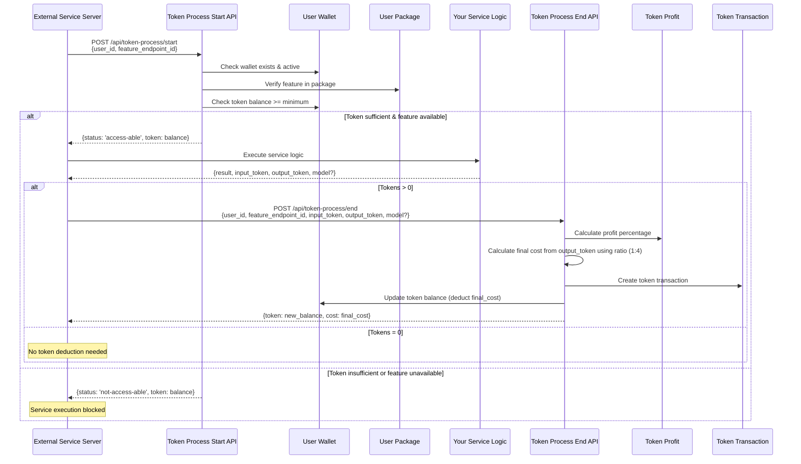

# Token Process Usage Guide

This guide explains how to use the Token Process module from other service servers. The Token Process module provides server-to-server token processing for validating user tokens, checking feature access, and managing token consumption.

## 📋 Table of Contents

- [Overview](#overview)
- [Prerequisites](#prerequisites)
- [Environment Setup](#environment-setup)
- [Usage Methods](#usage-methods)
  - [Method 1: Direct API Calls](#method-1-direct-api-calls)
  - [Method 2: Service Functions](#method-2-service-functions)
  - [Method 3: withTokenProcess Wrapper](#method-3-withtokenprocess-wrapper)
- [API Reference](#api-reference)
- [Error Handling](#error-handling)
- [Best Practices](#best-practices)
- [Examples](#examples)

---

## 🎯 Overview

The Token Process module allows external service servers to:

1. **Validate User Tokens**: Check if a user has sufficient tokens for a feature endpoint
2. **Verify Feature Access**: Ensure the user's package includes the requested feature
3. **Process Token Consumption**: Deduct tokens after service execution with automatic profit calculation

### Token Process Flow

```
1. Start Process → Validate wallet, check feature access, verify token balance
2. Execute Service → Run your service logic
3. End Process → Calculate final cost, deduct tokens, update wallet
```

#### Flow Diagram



#### Process Steps

```mermaid
flowchart TD
    A[Start: Token Process Request] --> B{Validate Wallet}
    B -->|Wallet Not Found| C[Error: Wallet Not Found]
    B -->|Wallet Found| D{Check Feature in Package}
    D -->|Feature Not Available| E[Error: Feature Not in Package]
    D -->|Feature Available| F{Check Token Balance}
    F -->|Insufficient Tokens| G[Error: Insufficient Tokens]
    F -->|Sufficient Tokens| H[Status: access-able]
    H --> I[Execute Service Logic]
    I --> J{Service Result}
    J -->|Has Tokens| K[Calculate Final Cost<br/>from output_token using ratio (1:4)<br/>Apply Profit Percentage]
    J -->|No Tokens| L[Skip Token Deduction]
    K --> M[Create Token Transaction]
    M --> N[Update Wallet Balance]
    N --> O[Return Updated Balance]
    L --> P[Return Service Result]
    O --> P
    P --> Q[End: Process Complete]
```

---

## 🔧 Prerequisites

Before using the Token Process module, ensure you have:

- Access to the Payment System Server
- `SERVER_API_KEY` from the Payment System Server administrator
- `TOKEN_SERVER_URL` (Payment System Server URL)
- Node.js environment with `axios` installed

---

## ⚙️ Environment Setup

Add the following environment variables to your `.env` file:

```env
# Payment System Server URL
TOKEN_SERVER_URL=http://localhost:5000

# Server API Key (obtained from Payment System Server admin)
SERVER_API_KEY=your-server-api-key-here
```

**Note**: The `SERVER_API_KEY` must match the one configured in the Payment System Server's environment variables.

---

## 📚 Usage Methods

There are three ways to use the Token Process module:

### Method 1: Direct API Calls

Use this method when you need full control over the API calls or are not using Node.js.

#### Implementation

```typescript
import axios from 'axios';

const TOKEN_SERVER_URL = process.env.TOKEN_SERVER_URL || 'http://localhost:5000';
const SERVER_API_KEY = process.env.SERVER_API_KEY || '';

// Start Token Process
const startTokenProcess = async (user_id: string, feature_endpoint_id: string) => {
  try {
    const response = await axios.post(
      `${TOKEN_SERVER_URL}/api/token-process/start`,
      {
        user_id,
        feature_endpoint_id,
      },
      {
        headers: {
          'x-server-api-key': SERVER_API_KEY,
          'Content-Type': 'application/json',
        },
      }
    );

    return response.data;
  } catch (error) {
    throw error;
  }
};

// End Token Process
const endTokenProcess = async (
  user_id: string,
  feature_endpoint_id: string,
  input_token: number,
  output_token: number,
  model?: string
) => {
  try {
    const response = await axios.post(
      `${TOKEN_SERVER_URL}/api/token-process/end`,
      {
        user_id,
        feature_endpoint_id,
        input_token,
        output_token,
        ...(model && { model }),
      },
      {
        headers: {
          'x-server-api-key': SERVER_API_KEY,
          'Content-Type': 'application/json',
        },
      }
    );

    return response.data;
  } catch (error) {
    throw error;
  }
};

// Usage Example
const processService = async (user_id: string, feature_endpoint_id: string) => {
  // 1. Start token process
  const startResult = await startTokenProcess(user_id, feature_endpoint_id);

  if (startResult.data.status !== 'access-able') {
    throw new Error(
      `Insufficient tokens. Available: ${startResult.data.token}`
    );
  }

  // 2. Execute your service logic
  const serviceResult = await yourServiceFunction(user_id);

  // 3. End token process (if tokens > 0)
  if (serviceResult.input_token > 0 || serviceResult.output_token > 0) {
    await endTokenProcess(
      user_id,
      feature_endpoint_id,
      serviceResult.input_token || 0,
      serviceResult.output_token || 0,
      serviceResult.model
    );
  }

  return serviceResult;
};
```

---

### Method 2: Service Functions

Use the provided service functions from `src/app/token-process/token-process.service.ts`. This method is cleaner and handles the API calls for you.

#### Setup

1. Copy the `token-process` folder from Payment System Server to your service server:
   ```
   payment-system-server/src/app/token-process/
   ```

2. Install required dependencies:
   ```bash
   npm install axios
   # or
   pnpm add axios
   ```

3. Set up environment variables (as shown in [Environment Setup](#environment-setup))

#### Implementation

```typescript
import {
  tokenProcessStart,
  tokenProcessEnd,
} from './token-process/token-process.service';

// Usage Example
const processService = async (user_id: string, feature_endpoint_id: string) => {
  // 1. Start token process
  const startResult = await tokenProcessStart({
    user_id,
    feature_endpoint_id,
  });

  if (startResult.data.status !== 'access-able') {
    throw new Error(
      `Insufficient tokens. Available: ${startResult.data.token}`
    );
  }

  // 2. Execute your service logic
  const serviceResult = await yourServiceFunction(user_id);

  // 3. End token process (if cost > 0)
  if (serviceResult.cost > 0) {
    try {
      await tokenProcessEnd({
        user_id,
        feature_endpoint_id,
        cost: serviceResult.cost,
      });
    } catch (error) {
      console.error('[Token Process] End error:', error);
      // Handle error (log, but don't block service result)
    }
  }

  return serviceResult;
};
```

#### Service Function Types

```typescript
// Start Token Process
tokenProcessStart(payload: {
  user_id: string;
  feature_endpoint_id: string;
}): Promise<TTokenProcessStartResponse>

// End Token Process
tokenProcessEnd(payload: {
  user_id: string;
  feature_endpoint_id: string;
  cost: number;
}): Promise<TTokenProcessEndResponse>
```

---

### Method 3: withTokenProcess Wrapper

Use this method for the cleanest and most automated approach. The wrapper handles the entire token process flow automatically.

#### Setup

1. Copy the `withTokenProcess.ts` utility from Payment System Server:
   ```
   payment-system-server/src/app/utils/withTokenProcess.ts
   ```

2. Copy the `token-process` service folder (as in Method 2)

3. Set up environment variables

#### Implementation

```typescript
import { withTokenProcess } from './utils/withTokenProcess';
import { yourServiceFunction } from './services/your-service';

// Option 1: Static user_id
const wrappedService = withTokenProcess(
  {
    feature_endpoint_id: 'your-feature-endpoint-id',
    user_id: 'static-user-id', // Use when user_id is known
  },
  yourServiceFunction
);

// Option 2: Dynamic user_id (extract from function arguments)
const wrappedService = withTokenProcess(
  {
    feature_endpoint_id: 'your-feature-endpoint-id',
    user_id: (args) => args[0].user_id, // Extract from first argument
  },
  yourServiceFunction
);

// Usage
const result = await wrappedService({ user_id: 'user-id', ...otherData });
```

#### Service Function Requirements

Your service function must:

1. Return a Promise
2. Return an object with an optional `cost` property:

```typescript
interface ServiceResult {
  cost?: number; // Token cost (required if tokens should be deducted)
  // ... other properties
}

const yourServiceFunction = async (...args: any[]): Promise<ServiceResult> => {
  // Your service logic
  const cost = calculateTokenCost(); // Calculate token cost

  return {
    cost, // Include cost if tokens should be deducted
    // ... other return values
  };
};
```

#### Complete Example

```typescript
import { withTokenProcess } from './utils/withTokenProcess';

// Your service function
const generateContent = async (data: {
  user_id: string;
  prompt: string;
  length: number;
}): Promise<{ content: string; cost: number }> => {
  // Your service logic here
  const content = await aiService.generate(data.prompt, data.length);
  const cost = calculateCost(data.length); // e.g., 10 tokens per 100 words

  return {
    content,
    cost,
  };
};

// Wrap the service function
const wrappedGenerateContent = withTokenProcess(
  {
    feature_endpoint_id: 'feature-endpoint-id-for-content-generation',
    user_id: (args) => args[0].user_id, // Extract user_id from first argument
  },
  generateContent
);

// Use the wrapped service
const result = await wrappedGenerateContent({
  user_id: 'user-123',
  prompt: 'Write a blog post about AI',
  length: 1000,
});

console.log(result.content); // Generated content
// Tokens are automatically deducted
```

---

## 📖 API Reference

### Start Token Process

**Endpoint**: `POST /api/token-process/start`

**Headers**:
```
x-server-api-key: <SERVER_API_KEY>
Content-Type: application/json
```

**Request Body**:
```typescript
{
  user_id: string;           // User ID
  feature_endpoint_id: string; // Feature endpoint ID
}
```

**Response**:
```typescript
{
  success: boolean;
  message: string;
  data: {
    user_id: string;
    token: number;           // Current user token balance
    status: 'access-able' | 'not-access-able';
  };
}
```

**Status Values**:
- `access-able`: User has sufficient tokens and feature access
- `not-access-able`: User lacks tokens or feature access

---

### End Token Process

**Endpoint**: `POST /api/token-process/end`

**Headers**:
```
x-server-api-key: <SERVER_API_KEY>
Content-Type: application/json
```

**Request Body**:
```typescript
{
  user_id: string;           // User ID
  feature_endpoint_id: string; // Feature endpoint ID
  cost: number;              // Token cost (after processing)
}
```

**Response**:
```typescript
{
  success: boolean;
  message: string;
  data: {
    user_id: string;
    token: number;           // Updated user token balance
    cost: number;            // Final cost (after profit percentage)
    status: 'return-able' | 'not-return-able';
  };
}
```

**Note**: The `cost` in the response includes the profit percentage automatically calculated by the server.

---

## ⚠️ Error Handling

### Common Errors

#### 1. Invalid Server API Key

```typescript
// Error Response
{
  success: false,
  status: 401,
  message: "Invalid server API key"
}
```

**Solution**: Verify `SERVER_API_KEY` in your `.env` file matches the Payment System Server configuration.

---

#### 2. User Wallet Not Found

```typescript
// Error Response
{
  success: false,
  status: 404,
  message: "User wallet not found"
}
```

**Solution**: Ensure the user has an active wallet with a valid package.

---

#### 3. Feature Not Available in Package

```typescript
// Error Response
{
  success: false,
  status: 403,
  message: "Feature endpoint is not available in your package"
}
```

**Solution**: Verify the user's package includes the requested feature.

---

#### 4. Insufficient Tokens

```typescript
// Start Response
{
  success: true,
  data: {
    status: 'not-access-able',
    token: 50  // Current token balance
  }
}
```

**Solution**: Check token balance and inform the user or handle gracefully.

---

### Error Handling Best Practices

```typescript
try {
  const startResult = await tokenProcessStart({
    user_id,
    feature_endpoint_id,
  });

  if (startResult.data.status !== 'access-able') {
    // Handle insufficient tokens
    throw new Error(
      `Insufficient tokens. Available: ${startResult.data.token}`
    );
  }

  // Execute service
  const result = await yourServiceFunction();

  // End process (with error handling)
  if (result.cost > 0) {
    try {
      await tokenProcessEnd({
        user_id,
        feature_endpoint_id,
        cost: result.cost,
      });
    } catch (error) {
      // Log error but don't block service result
      console.error('[Token Process] End error:', error);
      // Optionally: Retry logic or notification
    }
  }

  return result;
} catch (error) {
  // Handle start process errors
  if (error.response) {
    // API error
    console.error('Token Process API Error:', error.response.data);
  } else {
    // Network or other errors
    console.error('Token Process Error:', error.message);
  }
  throw error;
}
```

---

## 💡 Best Practices

### 1. Always Check Access Status

```typescript
const startResult = await tokenProcessStart({ user_id, feature_endpoint_id });

if (startResult.data.status !== 'access-able') {
  // Don't proceed with service execution
  throw new Error('Access denied');
}
```

### 2. Handle End Process Errors Gracefully

```typescript
if (result.cost > 0) {
  try {
    await tokenProcessEnd({ user_id, feature_endpoint_id, cost: result.cost });
  } catch (error) {
    // Log but don't block - user already received service
    console.error('Token deduction failed:', error);
    // Consider: Queue for retry or notify admin
  }
}
```

### 3. Use withTokenProcess for Simplicity

The wrapper handles all the complexity automatically:

```typescript
// Instead of manual start/end calls
const wrappedService = withTokenProcess(
  { feature_endpoint_id, user_id: (args) => args[0].user_id },
  yourServiceFunction
);
```

### 4. Calculate Cost Accurately

Ensure your service function calculates token cost correctly:

```typescript
const calculateCost = (inputLength: number, outputLength: number): number => {
  // Example: 1 token per 10 characters
  return Math.ceil((inputLength + outputLength) / 10);
};
```

### 5. Use Environment Variables

Never hardcode credentials:

```env
TOKEN_SERVER_URL=http://localhost:5000
SERVER_API_KEY=your-secure-api-key
```

---

## 📝 Examples

### Example 1: Simple Service with Direct API Calls

```typescript
import axios from 'axios';

const TOKEN_SERVER_URL = process.env.TOKEN_SERVER_URL!;
const SERVER_API_KEY = process.env.SERVER_API_KEY!;

async function processImage(user_id: string, image_url: string) {
  const feature_endpoint_id = 'image-processing-endpoint-id';

  // Start
  const start = await axios.post(
    `${TOKEN_SERVER_URL}/api/token-process/start`,
    { user_id, feature_endpoint_id },
    { headers: { 'x-server-api-key': SERVER_API_KEY } }
  );

  if (start.data.data.status !== 'access-able') {
    throw new Error('Insufficient tokens');
  }

  // Process
  const processedImage = await imageProcessingService.process(image_url);
  const cost = 50; // Tokens used

  // End
  await axios.post(
    `${TOKEN_SERVER_URL}/api/token-process/end`,
    { user_id, feature_endpoint_id, cost },
    { headers: { 'x-server-api-key': SERVER_API_KEY } }
  );

  return processedImage;
}
```

---

### Example 2: Service with Service Functions

```typescript
import {
  tokenProcessStart,
  tokenProcessEnd,
} from './token-process/token-process.service';

async function generateText(user_id: string, prompt: string) {
  const feature_endpoint_id = 'text-generation-endpoint-id';

  // Start
  const startResult = await tokenProcessStart({
    user_id,
    feature_endpoint_id,
  });

  if (startResult.data.status !== 'access-able') {
    throw new Error(`Insufficient tokens: ${startResult.data.token}`);
  }

  // Generate
  const generatedText = await aiService.generate(prompt);
  const cost = calculateCost(prompt.length, generatedText.length);

  // End
  if (cost > 0) {
    await tokenProcessEnd({
      user_id,
      feature_endpoint_id,
      cost,
    });
  }

  return generatedText;
}
```

---

### Example 3: Service with Wrapper

```typescript
import { withTokenProcess } from './utils/withTokenProcess';

// Define service function
const translateText = async (data: {
  user_id: string;
  text: string;
  target_language: string;
}): Promise<{ translated: string; cost: number }> => {
  const translated = await translationService.translate(
    data.text,
    data.target_language
  );
  const cost = Math.ceil(data.text.length / 100) * 5; // 5 tokens per 100 chars

  return { translated, cost };
};

// Wrap service
const wrappedTranslate = withTokenProcess(
  {
    feature_endpoint_id: 'translation-endpoint-id',
    user_id: (args) => args[0].user_id,
  },
  translateText
);

// Use wrapped service
const result = await wrappedTranslate({
  user_id: 'user-123',
  text: 'Hello, world!',
  target_language: 'es',
});
```

---

### Example 4: Service Without Cost (Free Feature)

```typescript
import { withTokenProcess } from './utils/withTokenProcess';

const getPublicData = async (data: {
  user_id: string;
  query: string;
}): Promise<{ data: any }> => {
  // No cost - free feature
  const data = await publicDataService.fetch(data.query);
  return { data }; // No cost property
};

const wrappedGetPublicData = withTokenProcess(
  {
    feature_endpoint_id: 'public-data-endpoint-id',
    user_id: (args) => args[0].user_id,
  },
  getPublicData
);

// Tokens won't be deducted (cost is 0 or undefined)
const result = await wrappedGetPublicData({
  user_id: 'user-123',
  query: 'search-term',
});
```

---

## 🔐 Security Notes

1. **Never expose `SERVER_API_KEY`** in client-side code
2. **Use HTTPS** in production for secure communication
3. **Validate user_id** on your server before making token process calls
4. **Log token operations** for audit purposes
5. **Handle errors securely** - don't expose internal error details to clients

---

## 📞 Support

For issues or questions:

1. Check the Payment System Server logs
2. Verify environment variables are set correctly
3. Ensure `SERVER_API_KEY` matches on both servers
4. Contact the Payment System Server administrator

---

**Last Updated**: 2025-01-22

**Version**: 1.0.0

