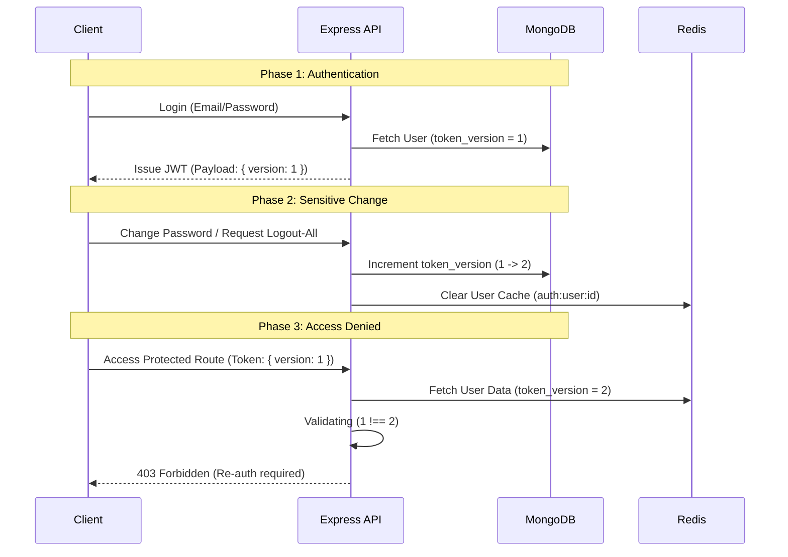

# Comprehensive Plan: Auth Token Versioning System

## 1. Objective
To implement a robust, high-performance session invalidation mechanism using `token_version`. This system ensures that once a user's sensitive data (password, role, or status) is modified, all previously issued JWT tokens (Access and Refresh) across all devices become instantly invalid, forcing a fresh re-authentication.

## 2. Problem Statement
The current system relies on `password_changed_at` (Timestamp) for session invalidation. While effective for passwords, it has several limitations:
- **Scope:** It doesn't naturally cover administrative actions like role promotion/demotion or account blocking.
- **Granularity:** Timestamp comparisons can occasionally be tricky with microsecond sync issues.
- **Functionality:** It doesn't provide a direct way to implement a "Logout from all devices" feature without changing the password.

## 3. Proposed Solution: The `token_version` Pattern

### A. Core Architecture
Every user document will maintain a numeric `token_version`. This version is an integer that increments whenever a security event occurs.

### B. Implementation Lifecycle

#### 1. Data Layer (Mongoose)
- **Field:** `token_version: { type: Number, default: 1 }` in `UserSchema`.
- **Automatic Increment:** A `pre-save` hook in the User model will detect changes to critical fields:
    - `password`
    - `role`
    - `status`
- **Manual Increment:** A dedicated service method to increment the version for "Logout all devices" events.

#### 2. Token Generation (Auth Service)
- The `TJwtPayload` will be updated to include the current `token_version`.
- All token-issuing methods (`signin`, `signup`, `googleSignin`, `refreshToken`) will embed the user's latest version into the JWT.

#### 3. Verification Layer (Auth Middleware)
Middleware will perform a real-time validation:
```typescript
if (decoded.token_version !== user.token_version) {
  throw new AppError(httpStatus.FORBIDDEN, 'Your session has expired due to security changes. Please log in again.');
}
```

## 4. Visual Workflow



## 5. Performance Optimization (Redis Strategy)
To avoid excessive DB queries in the `auth` middleware:
- **Caching:** The `token_version` along with the user's `role` and `status` will be stored in Redis.
- **Cache TTL:** 30 minutes (current setting).
- **Invalidation:** Every time `token_version` is incremented in the DB, the corresponding Redis key `auth:user:${_id}` will be deleted (`DEL`) to ensure subsequent middleware checks fetch the fresh version.

## 6. Security Considerations
- **Concurrency:** Using atomic increments (`$inc`) in MongoDB ensures that multiple simultaneous security updates don't lead to race conditions.
- **Old Token Rejection:** Even if an attacker has a stolen token that hasn't expired, it becomes useless the moment the version increments.
- **Graceful Transition:** For users with legacy tokens (no version), the middleware will handle them with a one-time re-auth or an optional fallback.

## 7. Affected Components
- `src/modules/user/user.type.ts` & `user.model.ts`
- `src/types/jsonwebtoken.type.ts`
- `src/modules/auth/auth.service.ts`
- `src/modules/auth/auth.route.ts`
- `src/middlewares/auth.middleware.ts`
- `src/config/redis.ts`
