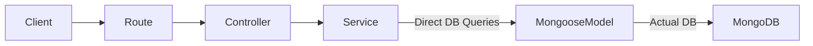
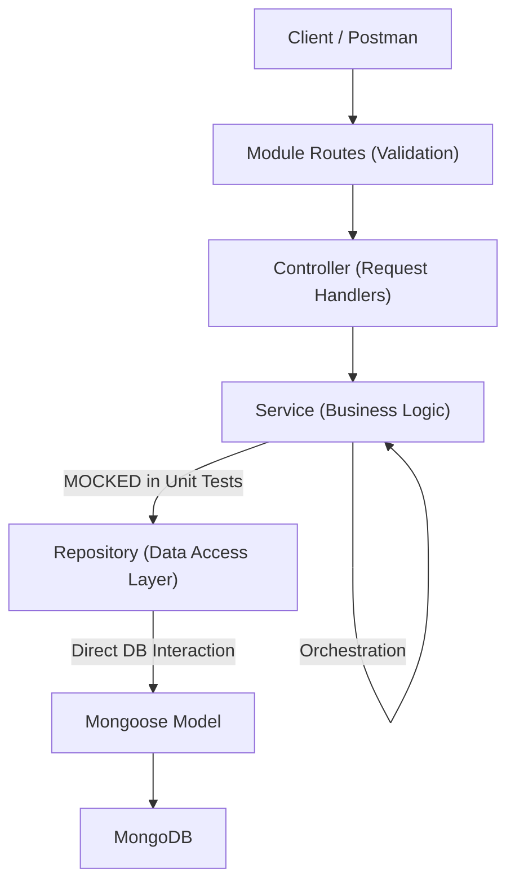

## 1. Architectural Transition: The "Flow"

### ❌ Current Architecture (Tightly Coupled)
Business logic and Database queries are mixed in the Service, making tests brittle and maintenance difficult.


### ✅ Proposed Architecture (Decoupled & Testable)
A clear separation of concerns where each layer has a single responsibility.


---

## 2. Problem Statement
Currently, many services (except `File`) directly interact with Mongoose models. This creates "Fat Services" that are:
- **Tightly Coupled:** Hard to change database logic without touching business logic.
- **Hard to Test:** Mocking Mongoose models in unit tests is complex and brittle.
- **Violates SRP:** Services are doing both orchestration and low-level data access.

---

## 2. Technical Strategy: Repository Pattern

### The New Architecture
`Route` → `Controller` → `Service` → `Repository` → `Model`

- **Repository:** Responsible *only* for direct DB calls (`find`, `create`, `update`, `aggregate`). It should return lean objects or documents but contain zero business logic.
- **Service:** Responsible for business rules, validation, file handling, and orchestrating multiple repositories.

### Implementation Pattern (Example: User Module)
- `user.repository.ts`:
  ```typescript
  export const findById = (id: string) => User.findById(id).lean();
  export const update = (id: string, data: Partial<TUser>) => User.findByIdAndUpdate(id, data, { new: true });
  ```
- `user.service.ts`:
  ```typescript
  import * as UserRepository from './user.repository';
  export const getUser = async (id: string) => {
    const user = await UserRepository.findById(id);
    if (!user) throw new AppError(404, 'User not found');
    return user;
  };
  ```

---

## 3. Testing Strategy

### A. Service Unit Tests
- **Location:** `src/modules/[module]/__tests__/[module].service.spec.ts`
- **Scope:** Test business logic by mocking the Repository functions.
- **Tool:** Jest / Vitest.

### B. Route Integration Tests
- **Location:** `src/modules/[module]/__tests__/[module].route.spec.ts`
- **Scope:** Test end-to-end API flow (Request → Middleware → Response).
- **Tool:** Supertest.

---

## 4. Migration Plan

### 4. Migration Plan (Iterative & Verified)

**Crucial Rule:** One module at a time. After implementing the Repository and Tests for a module, the tests *MUST* be run and confirmed successful before starting the next module.

### Phase 1: Core Modules
- **User Module** (Verified ✅)
- **Auth Module** (Verified ✅)
- **Payment Method & Transactions** (Verified ✅)

### Phase 2: Subscription & Packages
- **Package, Plan, User Subscription**.
- **Coupon Layer**.

### Phase 3: Credits & AI Models
- **AI Model, Credits Process/Profit/Usage**.
- **Billing Settings**.

### Phase 4: Support & Cleanup
- **Notification, Contact, Feature Feedback**.
- Final audit of `AppAggregationQuery` usage in repositories.
